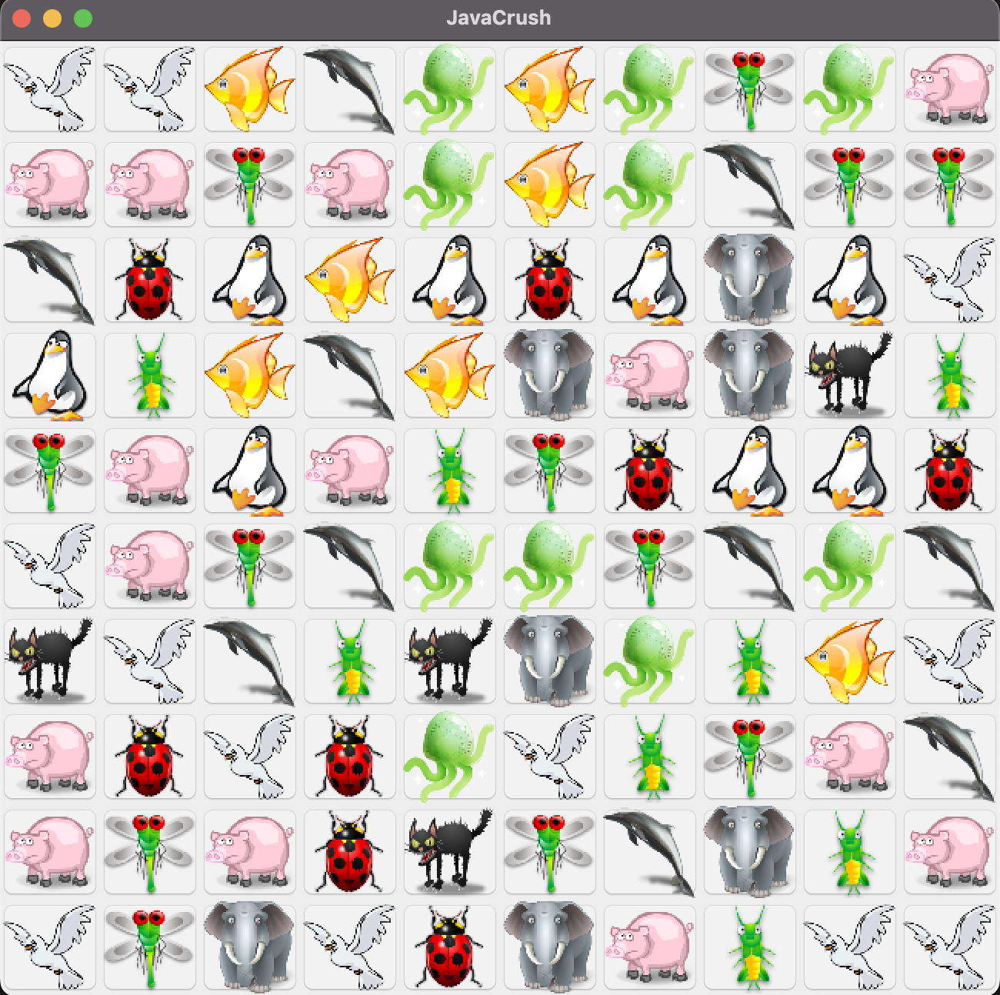
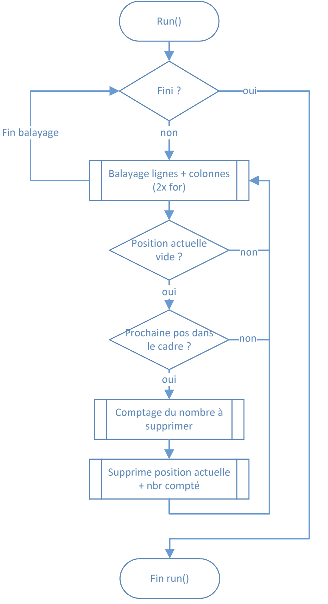

# Introduction
Developing games offers a fun and educational experience, allowing programmers to explore various concepts while creating something interactive. One such project is the JavaCrush game, modeled after the popular CandyCrush. The core objective is to align similar elements (in this case, animals) on a grid to clear them and gain points. This project also introduces the complex concept of multithreading, making it an excellent learning opportunity for Java programmers.

At the heart of JavaCrush lies a straightforward but engaging game mechanic. The player is presented with a grid filled with animal icons, and the goal is to align three or more identical animals, either horizontally or vertically. Once aligned, the animals disappear, and new ones are generated to replace them. The game's randomness ensures fresh gameplay every time.

 

# Threads
What distinguishes this project from a typical CandyCrush clone is its multithreaded architecture. JavaCrush utilizes three threads, each responsible for a specific task:

* Vertical Checker Thread: Scans the grid vertically, removing animals aligned in columns.
* Horizontal Checker Thread: Performs a similar task but scans horizontally.
* Gravity Thread: Ensures that animals above an empty space "fall" down to fill the gap, while new animals are generated to maintain a full grid.

This use of threads makes the game more dynamic, allowing multiple processes to run concurrently, which results in smoother gameplay.

# Game class structure
The JavaCrush project is built with a well-organized class structure. The VueCrush class extends JPanel and coordinates the game's core logic. The CandyButton class, which represents the individual grid items, holds an identifier for each animal. The checker threads all derive from a superclass Checker, which manages the game’s grid in a synchronized fashion to prevent conflicts during the game’s operations.

One of the most critical elements of this project was ensuring proper synchronization. Since multiple threads access the game grid simultaneously, synchronization prevents race conditions, where multiple threads could potentially modify the grid at the same time. Although methods like *wait()* and *notify()* were explored, they were ultimately not used in the final implementation to keep the code simpler and avoid unnecessary complexity.

Here is the checker threads logic:

 

# Conclusion

This project successfully demonstrates the implementation of multithreading in a game development context. The primary challenge was ensuring that the threads could run in parallel without causing any issues with the game logic. If more time were available, additional features such as combo moves (e.g., aligning both rows and columns simultaneously) could be implemented, enhancing the gameplay experience. Porting the game to Android would also be a logical next step, given the platform's popularity for mobile gaming.

JavaCrush exemplifies how multithreading can be applied to game development in a way that enhances performance. The project showcases key concepts such as synchronization, thread management, and object-oriented design.

For more information, here is the source code: [https://github.com/mekiisupertramp/javacrush](https://github.com/mekiisupertramp/javacrush)
