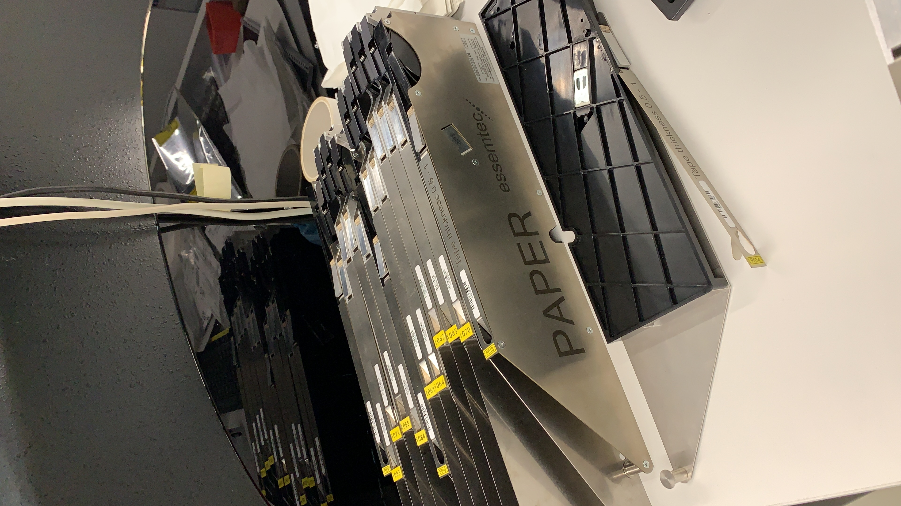
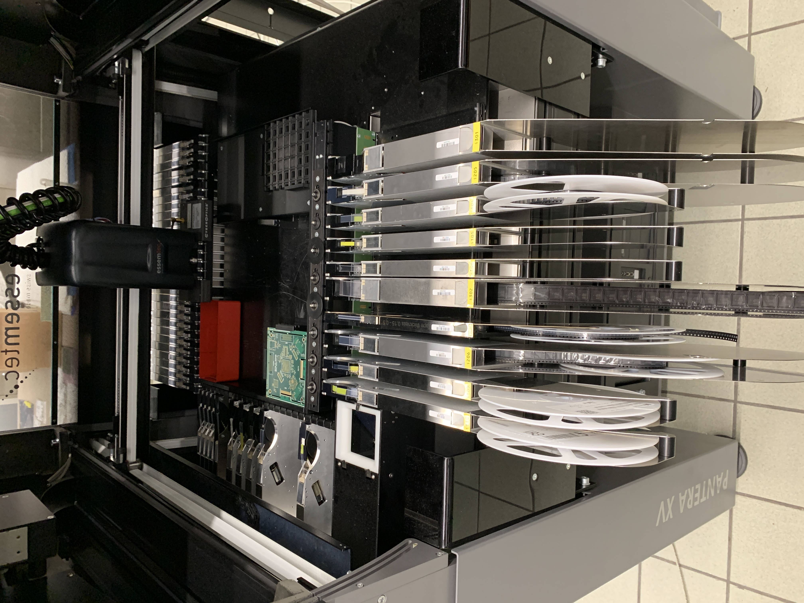
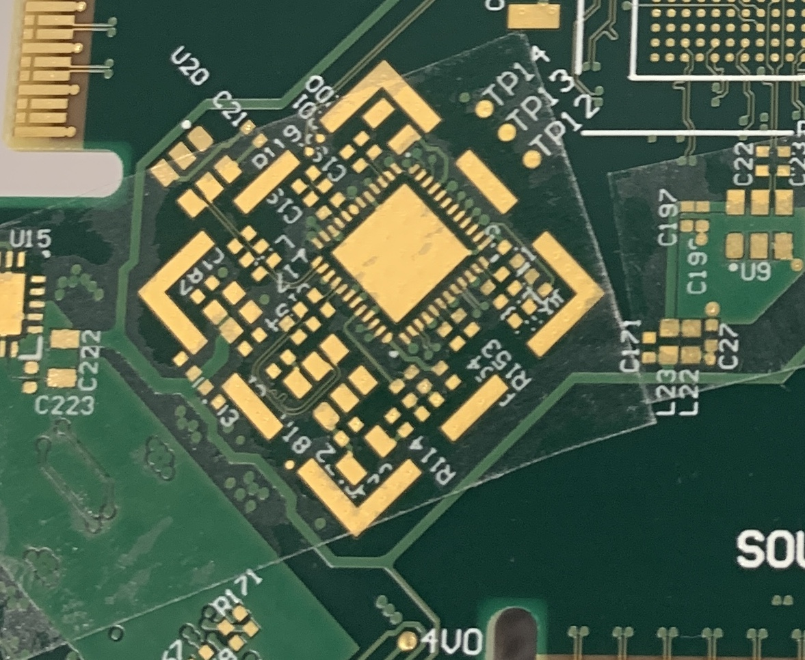
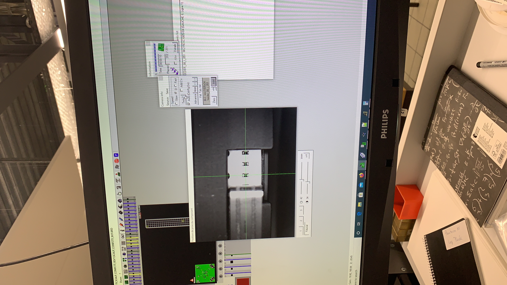
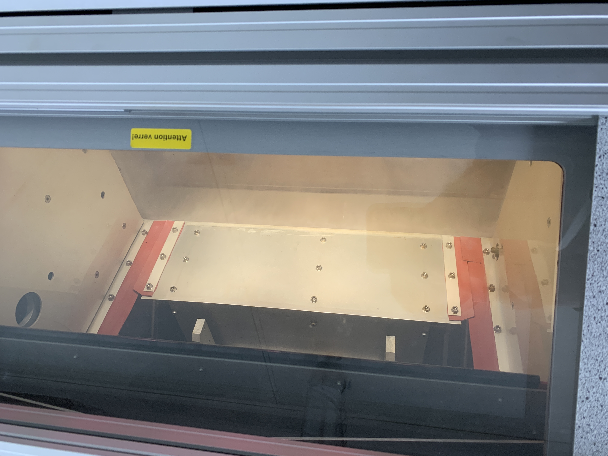
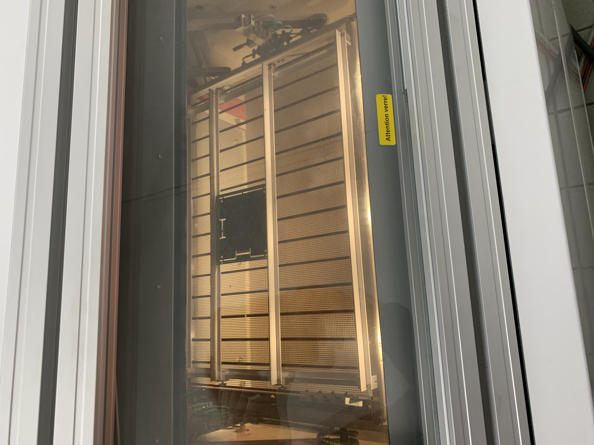
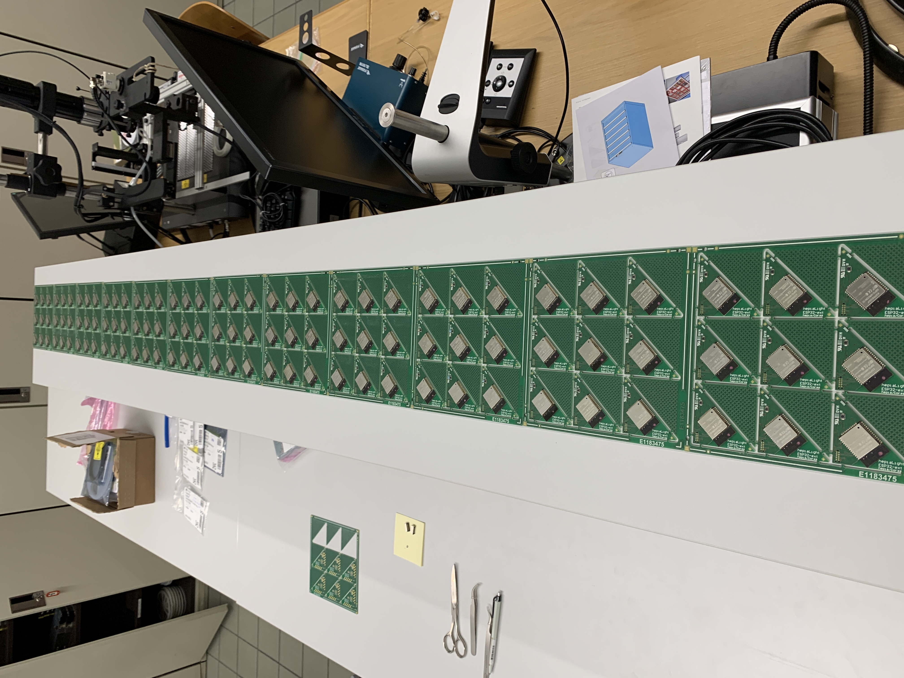

# Introduction
This task presents the process of mounting components on a PCB. The goal is to see the different parts of the assembly. Thanks to HEPIA (Geneva) who provided access to different machines. 

# Paste printing
This process can be done by hand using a credit card and a bit of skills; However, here we use a past printer. The printer will first clamps the PCB panel against the stencil. Then, the goal is to spread the solder paste slightly beyond the edges of the component pads by hand. The machine then forces the paste through the stencil apertures using its blades.

 

Unfortunately, no other pictures can be provided. But here should be printer's blades.

# Pick'n'place

Placing components on the PCB is the most important step, especially when mounting multiple PCB panels. Before applying the solder paste, component positions must be verified and this can be done by using simple double face tape. Once the positions are correct, the paste be spread.

 

Feeders

Before placing the feeders in the machine, the component's carrier tapes must be placed in the feeders. Feeders must be configured in the machine with the right component's library. Each component has its own library. In the case it hasn't, new libraries can be made (not detailed here). However, once the feeder is ready with component, it can be placed in the machine and linked to the machine's application. Then, the tape-test and fine-tuning can proceed.

 

Feeders ready

 

Double tape testing

You don't want all those components (and many more!) to be misplaced. 

 

Some positions fine-tuning

 

Components placing

# Steam phase oven
Thise is an oven which uses steam to solder components on their solder pads. The oven
heats water until it becomes steam and the resulting temperature rise is sufficient to melt the solder paste around each component’s pins. Then, the oven stops and the cooling phase begins until the PCB reaches 50°. 

 

 

# Result

 

This is a quick overview of the different steps to mount components on PCBs with industrial equipments. More details can be provided upon request. 
