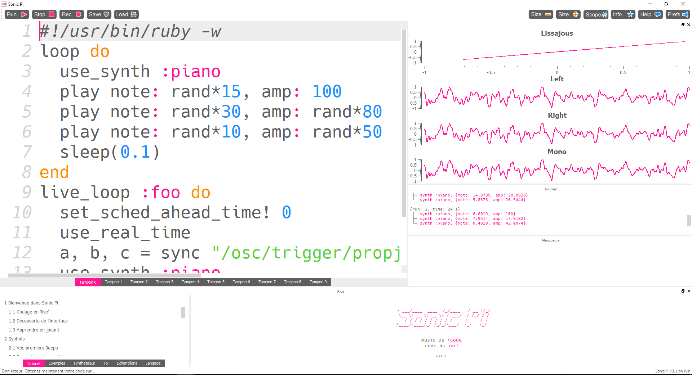

# Introduction

In today's tech-driven world, few tools match the accessibility and versatility of the Raspberry Pi. This small, affordable computer supports a wide range of projects, from programming basics to advanced DIY. Recently, I explored combining Raspberry Pi with Sonic Pi, a live coding environment that turns code into music. Together, they create a dynamic platform for music lovers and coders, transforming Ruby code into sound.

Originally designed to teach coding through music, Sonic Pi allows users to explore sound synthesis and digital music. Paired with Raspberry Pi, it enables everything from ambient tones to complex beats. This experiment was a first hands-on before making my own keyboard.

In this task, I'lls share what I did to make my first sounds and how to make it run at every power-up. 
Transforming the Pi into an standalone embedded keyboard.


<p align="center">
 
</p>

The above screenshot shows how Sonic Pi looks.

# Sonic Pi

Sonic Pi can work with several protocols like MIDI and OSC. Musical Instrument Digital Interface protocol is a technical standard that allows digital musical instruments, computers, and other related devices to communicate and synchronize with each other released in the 80's. Here, we'll use the second one which is also a communication protocol that enables electronic musical instruments, computers, and other multimedia devices to share data over a network using UDP/IP. Designed to overcome limitations of the MIDI protocol, OSC supports higher resolution, greater flexibility, and enhanced scalability. It transmits a wide range of data types, including messages, parameters, and commands, making it widely adopted in modern digital audio and multimedia environments for real-time interactive control.

By default, the OSC server should be activated locally. If you want to allow other devices to make sound you must enable it in Preferences -> IO -> Networked OSC -> Allow OSC from other computers. Then, here is a simple script making Sonic Pi listening the OSC messages and play notes. 

```ruby
#!/usr/bin/ruby -w

live_loop :foo do
	set_sched_ahead_time! 0                         # reduce latency to minimum
	use_real_time                                   # realtime mode
        a, b, c = sync "/osc/trigger/propjet"           # makes the loop wait on message and get the note, the amplitude and the duration of the note (not used here)
	use_synth :piano
	play note: a, amp: b
end
```

Here, we use a simple *piano* type of synthesizer but there is many, see: [https://github.com/sonic-pi-net/sonic-pi/blob/dev/etc/doc/cheatsheets/synths.md](https://github.com/sonic-pi-net/sonic-pi/blob/dev/etc/doc/cheatsheets/synths.md)
Now, the OSC server is ready, and listening on local ip on the default port 4559

# Raspberry's GPIOs

Now, the goal is to listen the Pi's GPIOs and send a message to our OSC server. Below are the Pi 3 ports.

<p align="center">
 
</p>

There is a bunch of methods to read GPIO's on a Pi like Python libraries, C libraries, using sysfs, Java libraries, coding our own kernel device, etc. Here the RPi.GPIO package is used to monitor inputs and the pythonosc package is used for sending messages to our OSC server. 

Once the packages are imported, one should set up the GPIOs. Here is a sample for one GPIO:

```python

    GPIO.setup(5,GPIO.IN,pull_up_down=GPIO.PUD_DOWN)
```

Here, the GPIO5 is used as an input and uses an internal pull down resistor.

# Make it rock!

# Conclusion
blablabal...

You can find the scripts here: [https://github.com/mekiisupertramp/sonic-pi/tree/main](https://github.com/mekiisupertramp/sonic-pi/tree/main)

When we rely on others’ generosity and expertise to provide answers to our questions, it should hold that the question we ask should be one that leads to 
