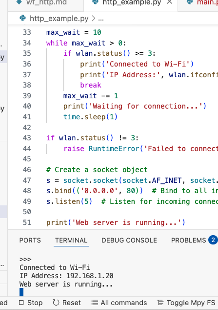
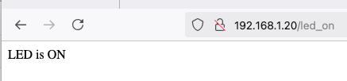
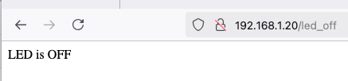
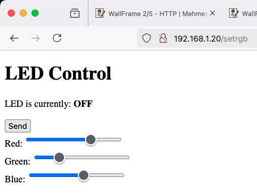
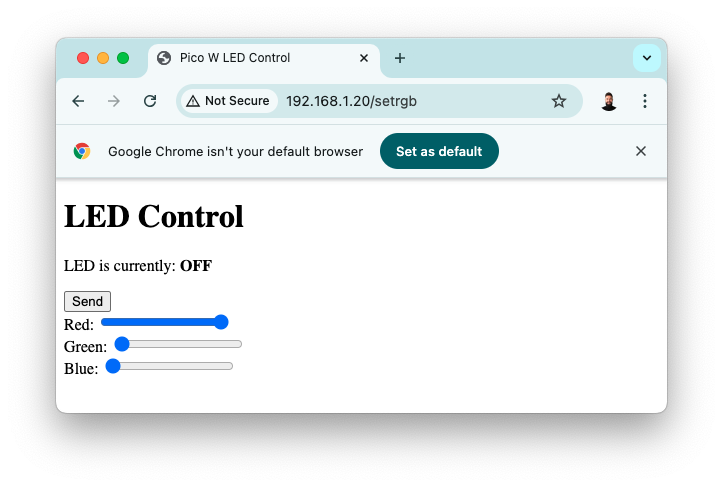
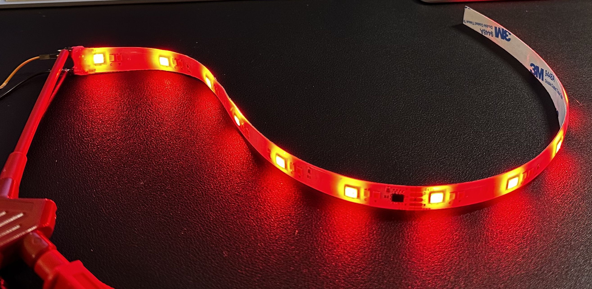
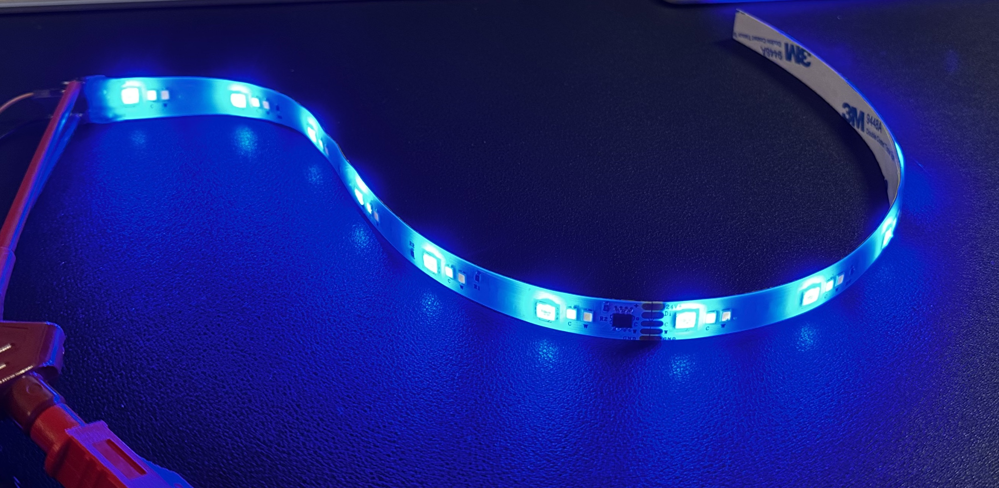
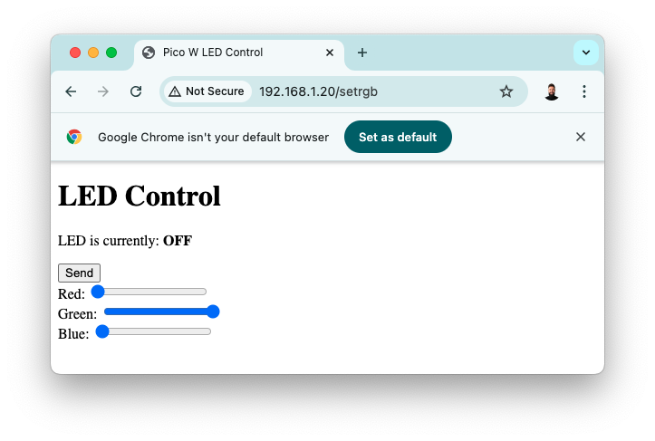
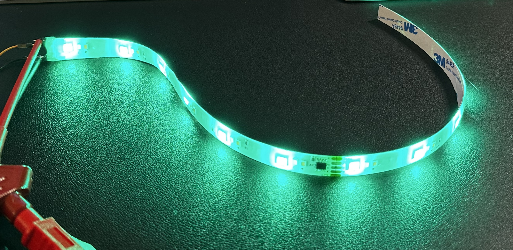

# Introduction
In this post, we will see how to set up a basic HTTP server to control RGB stripes through a simple user interface. It is strongly recommended to see the [preceding](https://mekiisupertramp.github.io/essays/wf_rgb.html) post before proceeding.

<p align="center">
 
</p>

<p align="center">RPi Pico W pinout</p>


# Simple HTTP LED control
Let's set-up a simple HTTP server which allows the control of the on-board LED with simple HTTP GET commands. 

### Wifi & LAN configuration
Folowing code allows to configuration of the WIFI, and LAN interface. 
```python
import network
import time
import socket
import machine

# WiFi's name & pass
ssid = 'xxxx'
password = 'xxxx'

# Initialize the LED on GPIO pin 25 (onboard LED)
led = machine.Pin("LED", machine.Pin.OUT)
led.off()  # Ensure the LED is off initially

# Define the static IP address for the Raspberry Pi Pico WH
static_ip = '192.168.1.20'
# Define the subnet mask for the network
subnet_mask = '255.255.255.0'
# Define the gateway IP address, usually the IP of your router
gateway = '192.168.1.1'
# Define the DNS server IP address, using Google's DNS in this case
dns_server = '8.8.8.8'

# Initialize the Wi-Fi interface in station mode
wlan = network.WLAN(network.STA_IF)
# Activate the Wi-Fi interface
wlan.active(True)
# Set the hostname for the device
wlan.config(hostname="MyPicoW-1")
# Configure the Wi-Fi interface with the static IP, subnet mask, gateway, and DNS server
wlan.ifconfig((static_ip, subnet_mask, gateway, dns_server))
# Connect to the Wi-Fi network using the provided SSID and password
wlan.connect(ssid, password)
```
### Connection to Wifi
The Pi will try to connect to WiFi during 10 seconds, and  print a message if successful. 

```python
max_wait = 10
while max_wait > 0:
    if wlan.status() >= 3:
        print('Connected to Wi-Fi')
        print('IP Address:', wlan.ifconfig()[0])
        break
    max_wait -= 1
    print('Waiting for connection...')
    time.sleep(1)

if wlan.status() != 3:
    raise RuntimeError('Failed to connect to Wi-Fi')
```
<p align="center">
 
</p>

<p align="center">Wifi connected</p>

### Socket binding
```python
# Create a socket object
s = socket.socket(socket.AF_INET, socket.SOCK_STREAM)
s.bind(('0.0.0.0', 80))  # Bind to all interfaces on port 80 (HTTP)
s.listen(5)  # Listen for incoming connections
```
### Handling clients
For each connection, print the content, and respond to the HTTP GET depending on URLs. 
```python
while True:
    conn, addr = s.accept()
    print('Got a connection from %s' % str(addr))
    request = str(conn.recv(1024))
    print('Content = %s' % request)

    if '/led_on' in request:
        led.on()
        response = 'LED is ON'
    elif '/led_off' in request:
        led.off()
        response = 'LED is OFF'
    else:
        response = 'Unknown request'

    conn.send('HTTP/1.1 200 OK\n')
    conn.send('Content-Type: text/html\n')
    conn.send('Connection: close\n\n')
    conn.sendall(response)
    conn.close()
```

<p align="center">
 
</p>

<p align="center">Client side</p>
<p align="center">
 
</p>

<p align="center">LED off</p>

# RGB
Now that we saw how to do a basic and simple web server, let's see the modifications needed to add the RGB stripes. First, add the strip as seen [here](https://mekiisupertramp.github.io/essays/wf_rgb.html).

```python
pin = Pin(0)
ledQty = 2
strip = neopixel.NeoPixel(pin,ledQty)

led = Pin("LED", Pin.OUT)
red = 180
green = 0
blue = 150
```
Now, we use a full HTML response with sliders: 
```python
# HTML response for the web page
html = """<!DOCTYPE html>
<html>
<head>
    <title>Pico W LED Control</title>
</head>
<body>
    <h1>LED Control</h1>
    <p>LED is currently: <strong>{}</strong></p>
    <form action="/setrgb" method="post">
    <button type="submit">Send</button>
    <div>
    Red:
        <input type="range" min="0" max="255" value={} class="slider" id="slideR" name="RED">
    <div>
        Green:
        <input type="range" min="0" max="255" value={} class="slider" id="slideG" name="GREEN">
    </div>
    <div>
        Blue:
        <input type="range" min="0" max="255" value={} class="slider" id="slideB" name="BLUE">        
    </div>
    </form>
</body>
</html>
"""
```

To finish, manage the different URLS: 
```python
    
    if '/setrgb' in request_str: # get value of each color (from str to int)
        if request_str.find('RED=') != -1:
            red = int(request_str.split('RED=')[1].split('&')[0]) # store red's value & print it
            print('value of red is: ', red)
            blue = int(request_str.split('BLUE=')[1].split("'")[0]) # store blue's value & print it
            print('value of blue is: ', blue)
            green = int(request_str.split('GREEN=')[1].split('&')[0]) # store green's value & print it
            print('value of green is: ', green)
            strip[0] = (blue, red, green) # set stripes color
            strip[1] = (blue, red, green)
            strip.write() # send colors
            led.value(1)  # flash the LED
            time.sleep_ms(200)
            led.value(0)
    if '/ledon' in request_str:
        led.value(1)
    if '/ledoff' in request_str:
        led.value(0)
```

<p align="center">
 
</p>

<p align="center">Client side</p>


# Test
<p align="center">
 
</p>
<p align="center">
 
</p>
<p align="center">
 
</p>
<p align="center">
 
</p>
<p align="center">
 
</p>
<p align="center">
 
</p>


# Next
At this stage, the RGB strips can be controlled directly via a web browser, providing a core setup for further development. This serves as the groundwork for integrating the system into more advanced environments, such as Home Assistant. The next post will delve into Homebridge integration in greater details. 
