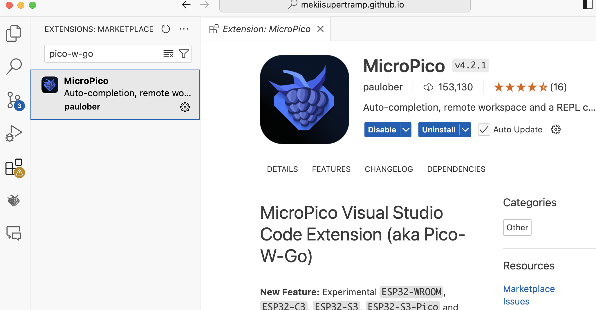
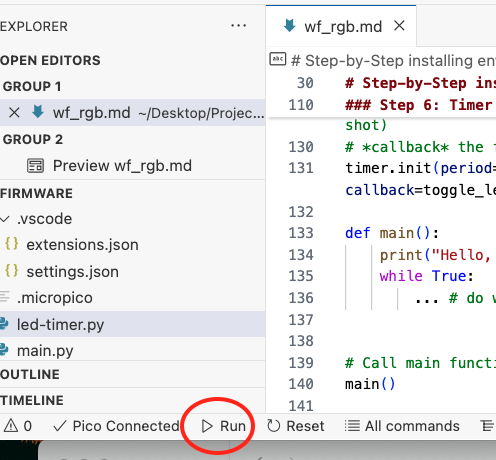
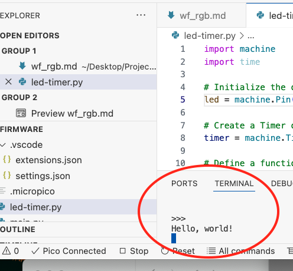
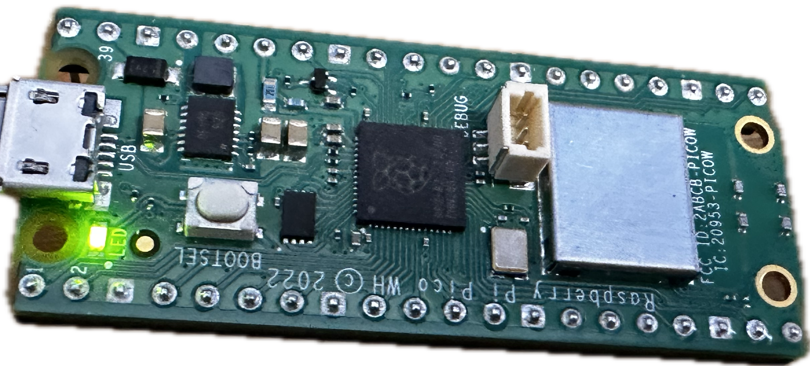
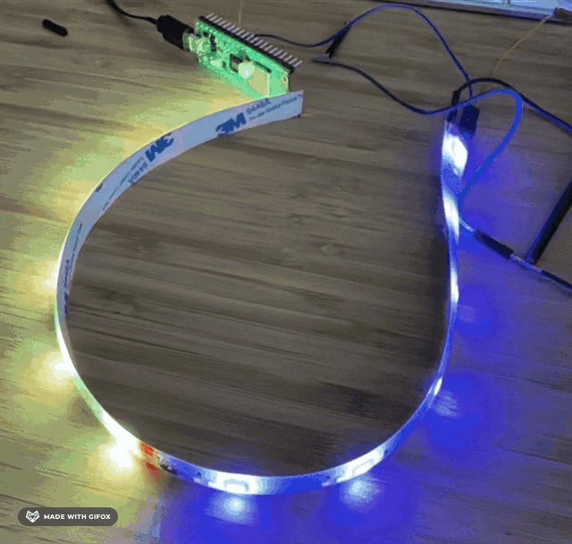

# Introduction
This guide will walk you through the process of setting up Visual Studio Code (VS Code) for programming the Raspberry Pi Pico W using the MicroPico module, and then driving RGB LEDs (e.g. WS2812B). The Raspberry Pi Pico W is a microcontroller board with built-in Wi-Fi capabilities, and the MicroPico module allows you to program it using MicroPython.

<p align="center">
 
</p>

<p align="center">RPi Pico W pinout</p>

# Prerequisites
- Raspberry Pi Pico W board
- Visual Studio Code (VS Code) installed on your computer
- MicroPico module
- MicroPython firmware for Raspberry Pi Pico W
- WS2812B RGB stripes

All electronics will be explained in a futur post. 

# Step-by-Step installing environment and testing
Short walks through MicroPython environment from installation to testing the onboard LED. 
### Step 1: Install the MicroPython Firmware
1. **Download the MicroPython Firmware**:
   - Go to the [MicroPython download page](https://micropython.org/download/rp2-pico-w/).
   - Download the latest MicroPython firmware for the Raspberry Pi Pico W.

2. **Flash the Firmware**:
   - Hold down the *BOOTSEL* button on the Pico W while plugging it into your computer via USB.
   - This will mount the Pico W as a storage device.
   - Drag and drop the downloaded `.uf2` firmware file onto the mounted storage device.
   - The Pico W will automatically reboot with the new firmware.

### Step 2: Install VS Code Extensions
1. **Open VS Code**:
   - Launch Visual Studio Code on your computer.

2. **Install the Python Extension**:
   - Go to the Extensions view by clicking the Extensions icon in the Activity Bar on the side of the window or by pressing `Ctrl+Shift+X`.
   - Search for "Python" and install the extension provided by Microsoft.

3. **Install the MicroPico Extension**:
   - Search for "MicroPico" in the Extensions view.
   - Install the "MicroPico" extension.

<p align="center">
 
</p>

<p align="center">RPi Pico W pinout</p>

### Step 3: Configure VS Code
1. **Open a Folder**:
   - Open a new folder or an existing project folder where you will store your MicroPython scripts.
   - If new project, `Ctrl+Shift+P` and then "Initialize MicroPico project"

2. **Configure the MicroPico Extension**:
   - Go to the Command Palette by pressing `Ctrl+Shift+P`.
   - Type "MicroPico: Connect" and select it.
   - Follow the prompts to connect to your Pico W board.

3. **Create a New MicroPython Script**:
   - Create a new file with a `.py` extension in your project folder.
   - Write your MicroPython code in this file.

### Step 4: Upload and Run Your Code
1. **Upload the Script**:
   - Save your script.
   - Use the Command Palette (`Ctrl+Shift+P`) and type "MicroPico: Upload and Run" to upload and run your script on the Pico W.
   - Or use this icons if connected properly:

<p align="center">
 
</p>

<p align="center">Run</p>

<p align="center">
 
</p>

<p align="center">Terminal shows up</p>

2. **Interact with the Serial Monitor**:
   - To view the output from your Pico W, use the Command Palette (`Ctrl+Shift+P`) and type "MicroPico: Serial Monitor".
   - This will open a terminal window where you can see the output from your script running on the Pico W.

### Step 5: Example Code
Here is a simple example of a MicroPython script to blink an onboard LED:

```python
import machine
import time

# Initialize the onboard LED
led = machine.Pin("LED", machine.Pin.OUT)

# Blink the LED indefinitely
while True:
    led.on()
    time.sleep(1)
    led.off()
    time.sleep(1)

```

### Step 6: Timer improvements
The folowing code provides another way of driving the led by setting a timer (newbies)
```python

import machine
import time

# Initialize the onboard LED
led = machine.Pin("LED", machine.Pin.OUT)

# Create a Timer object
timer = machine.Timer()

# Define a function with timer as parameter
def toggle_led(timer):
    led.toggle()

# Initialise the timer to call the function *toggle_led* 
# *period* in milliseconds
# *mode* calling the function periodically (vs one shot)
# *callback* the function to be called
timer.init(period=200, mode=machine.Timer.PERIODIC, callback=toggle_led)

def main():
    print("Hello, world!")
    while True:
        ... # do what you want


# Call main function
main()

```

You can find it [here](https://github.com/mekiisupertramp/wallframe/blob/main/led_timer.py)

<p align="center">
 
</p>

<p align="center">LED</p>

# RGB
Here is an example on how to drive the RGB stripes.
## Initialisation
```python
# Setting the GP0 pin (#1 on the RP2040's connector)
pin = machine.Pin(0)
# Setting the number of stripes
ledQty = 2
# Create a strip object
strip = neopixel.NeoPixel(pin,ledQty) 
```

## Set colors & write to strip
```python
# set color BRG (24=3*8 bits)
b = 30
r = 30
g = 0
strip[0] = (b, r, g) # type: ignore | purple
b = 0
r = 30
g = 30
strip[1] = (b, r, g) # type: ignore | yellow
strip.write()s
```
<p align="center">
 
</p>

<p align="center">RGB first colours</p>

## Do something random
```python
# Do something completly random (what? it's my code!)
while True:
    time.sleep_ms(20)
    b = b+10
    g = g+5
    if b > 80:
        g = g+10
    strip[0] = (g,30,15) # type: ignore
    strip[1] = (0, b, g) # type: ignore
    strip.write()
```

<p align="center">
 
</p>

<p align="center">RGB random</p>


# Next
At this stage, all components have not been selected. Details regarding the electronics will be outlined in a separate post. The next one will focus on how to run an HTTP server on the Pico, and drive the LED via the server. For more information, please see: [https://github.com/mekiisupertramp/wallframe/blob/main/rgb.py](https://github.com/mekiisupertramp/wallframe/blob/main/rgb.py)