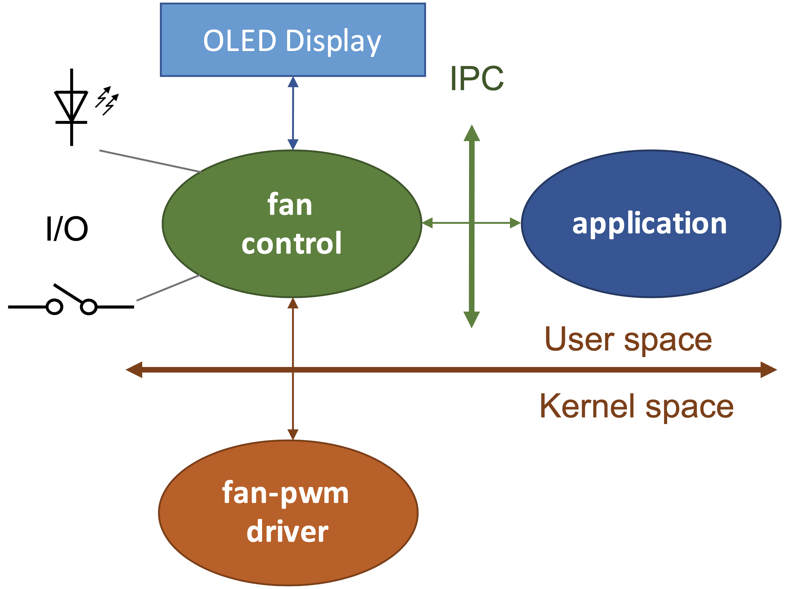
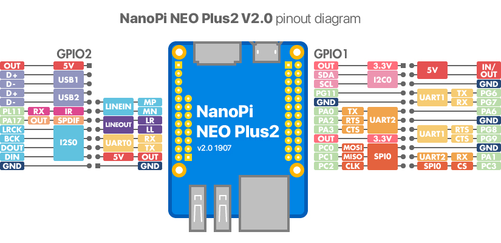
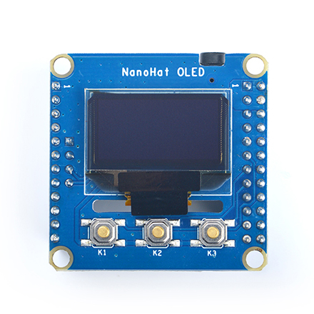
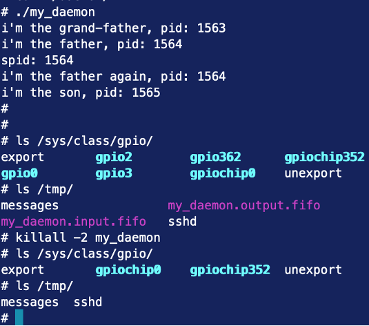
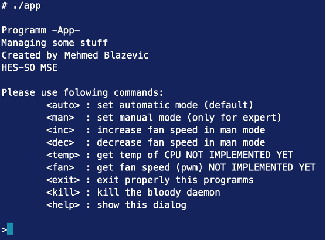
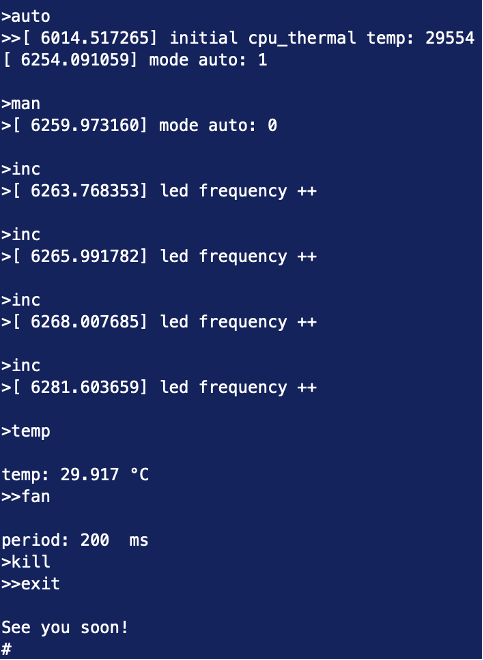

# Introduction 

Dissipating the heat generated by the processor and its peripherals is a critical aspect to consider when designing embedded systems. Natural convection cooling is ideal but may not always be sufficient. In such cases, a forced cooling system will complement it and ensure the proper functioning of the equipment. The project focuses on implementing an embedded system under Linux with a specific emphasis on kernel programming, device drivers, and multitasking applications. The goal is to simulate fan speed control based on CPU temperature using an embedded Linux platform. Here is what the system looks like:

<p align="center">
 
</p>


# Target 

For this project, the NanoPi NEO Plus2 was used with it's NanoHat OLED display. This board is based on an Alwinner ARM SOC with following features: 
- Allwinner H5, Quad-core 64 bits Cortex A53
- 1 GB DDR3 RAM
- 8 GB eMMC storage
- Network 10/100/1000M Ethernet based on RTL8211E-VB-CG
- WiFi 802.11b/g/n
- Bluetooth 4.0 dual mode
- MicroSD slot
- Audio input/output
- MicroUSB power input
- 2 status LED
- Power supply 5V/2A
- PCB dimmension 40 x 52 mm

And here is the board's pinout:

<p align="center">
 
</p>

Since the target platform lacks a physical fan, and the PWM output pin is already used by the system's consol, the target uses the blinking of a status LED to represent the fan’s speed, controlled via a timer for frequency modulation.

The display comes from FriendlyElec and has several features:
- Monochrome OLED module with high contrast, and low power consumption
- 0.96" display with a resolution of 128x64
- I2C 
- USB Type-A
- Audio jack
- 3 buttons
- Same form factor as the NanoPi (can be staked)


<p align="center">
 
</p>

# Linux

This project is separate in 3 different levels. Each of those levels has specific tasks:

- **Kernel Module**:
A kernel module monitors the CPU temperature and automatically adjusts the LED's blinking frequency (representing fan speed). The module also offers a **sysfs** interface to switch between automatic and manual fan modes and adjust the LEDs blinking frequency. The LED's blinking frequency will depend on the temperature as folow:
  - T < 35°C -- 2Hz
  - T < 40°C -- 5Hz
  - T < 45°C -- 10Hz
  - T >= 45°C -- 20Hz


- **User-Space Daemon**:
A user-space daemon handles manual control of the fan speed through physical buttons or an **IPC** interface. The daemon communicates with the kernel module and updates the OLED display, showing the operating mode, CPU temperature, and current blink frequency. The buttons control the system as follow:
  - Button S1 : increase the blinking frequency, pressure must be signaled on the second LED (blink once)
  - Button S2 : decrease the blinking frequency, pressure must be signaled on the second LED (blink once)
  - Button S3 : change between manual, and automatic modes

- **Application Interface**:
A command-line application communicates with the daemon via **IPC**, allowing users to set the operating mode and manually control the LED frequency. This provides a comprehensive simulation of fan control in both automatic and manual modes.


# Kernel Module 
### Preface 
To facilitate the module's access to various kernel features, here is some informations. First, the Linux kernel's **linux/thermal.h** module provides services for reading the temperature of various zones within the microprocessor. With the following two methods, it is possible to obtain the temperature of μP zones in thousandths of a degree:

```c
struct thermal_zone_device* thermal_zone_get_zone_by_name(const char* name);
int thermal_zone_get_temp(struct thermal_zone_device*, unsigned long* temp);
```
In it's current configuration, the CPU only implements one zone called *cpu_thermal*.

Then we need to access the GPIOs. The **linux/gpio.h** (deprecated) interface in the Linux kernel provides the necessary services for controlling an input/output pin:

```c
int gpio_request(unsigned gpio, const char* label);
void gpio_free(unsigned gpio);
int gpio_direction_output(unsigned gpio, int value);
void gpio_set_value(unsigned gpio, int value);
```

Finally, as the PWM can't be used, a timer can be utilized to control the LED blinking frequency. To do so, **linux/timer.h** provides services for timer management:

```c
#define timer_setup(timer, callback, flags)
int del_timer(struct timer_list *timer);
int mod_timer(struct timer_list *timer, unsigned long expires);
```


### Module
The kernel module developed for this project manages the LED blinking speed in two modes: <u>manual</u> and <u>automatic</u>. Three files were created in **sysfs** for this purpose, accessible for reading and writing:

- **/sys/devices/platform/skeleton/mode**: 1 = automatic, 0 = manual
- **/sys/devices/platform/skeleton/op**: 1 = shorter period, 0 = longer period (manual mode only)
- **/sys/devices/platform/skeleton/period**: reads the current period in milliseconds
- **/sys/class/thermal/thermal_zone0/temp**: reads the CPU temperature, already available prior to the development of the kernel module for the project.

The GPIO used by the status LED is number 10, managed using the **linux/gpio.h** library. As recommended, the **linux/timer.h** module was used to configure timers:

- To read the CPU temperature every second in automatic mode and adjust the LED blinking period accordingly
- To control the LED blinking rate, either based on the latest CPU temperature (within the last second) in automatic mode or as per user input in manual mode
The blinking period is stored as an integer in the code and converted to a character buffer using snprintf, as required for sysfs operations.

Specific functions allow those functionnality:

- *skeleton_init* & *skeleton_exit* : set up and free the module properly
- *skeleton_show_period* : show the period in miliseconds when reading **/sys/devices/platform/skeleton/period**
- *skeleton_store_op* : increase (1) or decrease (0) the period when writing in **/sys/devices/platform/skeleton/op**
- *skeleton_show_op* : show the last operation (0 or 1) on the LED's period in **/sys/devices/platform/skeleton/op**
- *skeleton_store_mode* : store the mode (0 = manual, 1 = auto) in **/sys/devices/platform/skeleton/mode**
- *skeleton_show_mode* : show the mode (0 = manual, 1 = auto) in **/sys/devices/platform/skeleton/mode**
- *timer_read_temp_callback* : timer's callback, read CPU temp when called 
- *timer_status_led_callback* : timer's callback, toggle the LED

The module can be inserted with either insmod or modprobe (module's makefile already copy the module in the right directory). For more informations, here is the module's code: [https://github.com/mekiisupertramp/fanless_fancontrol/blob/main/module/skeleton.c](https://github.com/mekiisupertramp/fanless_fancontrol/blob/main/module/skeleton.c)


# Daemon

A daemon is a background process that runs independently of any user interface and performs tasks or waits to provide specific services to the system or user applications. Daemons are typically started during the boot process (init process ppid=1) and remain running to handle requests (e.g., system services like networking, logging, or scheduled jobs) or to perform periodic background tasks. They are identified by the "d" suffix (e.g., httpd for web server or sshd for SSH daemon) and are often managed by system initialization like *systemd*.

### Creating

Contrary to kernel modules, daemons don't need specific interfaces or modules to be created. Any program could be a daemon if it follows these steps:
- Create a new process using *fork()* and terminate parent process with *exit()*
- Create a new session for the newly created process with *setsid()*
- Create the "real daemon" process with *fork()* again
- Catch signals with *sigaction()*
- Update the permission mask for file access with *umask(027)* 
  - Means that only group members are granted read permission:
    - 640 (rw-r-----) // for new files created by the process
    - 750 (rwxr-x---) // directories permission
- Updates the working directory with *chdir("/")*
- Close all standard file descriptors with *close()*
- Redirect them in **/dev/null** with *open()* & *dup2()* 

### Starting

Starting a daemon on Linux is an essential part of system administration, as daemons are responsible for background tasks and essential services. Over time, methods for managing and starting daemons have evolved to improve control, reliability, and integration with system boot processes.

Originally, daemons were launched through simple startup scripts in directories like **/etc/init.d/**, which provided basic *start*, *stop*, and *restart* controls. However, these scripts required manual setup and were limited in monitoring capabilities. With the introduction of *systemd* on modern Linux systems, managing daemons became more streamlined and reliable. *Systemd* offers advanced features like automatic restarts, dependency management, and precise control over the daemon's runtime environment. Here, just launching the daemon as a regular program is fine as the goal is mostly to use **IPCs**.

### Functionality


The daemon can communicate with the module through **sysfs** and with the client application via **FIFOs**. It also manages the various GPIOs exporting them . An *epoll* syscall has been implemented to monitor the three buttons and the input FIFO. To ensure the OLED display functions properly, it is necessary to enable the **I2C** bus in the device tree. The daemon can be terminated using *SIGKILL*, *SIGQUIT*, *SIGTERM*, or through the application. To summerize, here is the components used by the daemon:

- epoll: monitors 4 file descriptors (3 GPIOs + 1 FIFO)
- 2 threads: main thread + the thread updating the LCD display every second
- 2 FIFOs: one for receiving commands and another for sending temperature and/or fan speed
- 3 GPIOs: the buttons on the board
- 1 GPIO: the power LED (just a feedback when pressing a button)
- File descriptors: interface with kernel, the driver, and the FIFOs (*str_fd_gpios*, *str_fd_driver*, and *str_fd_fifos* in the code)

When launched, the daemon displays the PIDs for the parent and child processes. Below is an example of execution:

<p align="center">
 
</p>

This example confirms that the GPIOs and FIFOs are properly instantiated and then correctly destroyed upon termination. For more information, please see the source code here: [https://github.com/mekiisupertramp/fanless_fancontrol/blob/main/daemon/my_deamon.c](https://github.com/mekiisupertramp/fanless_fancontrol/blob/main/daemon/my_deamon.c)


# App
The application is quite simple. When started, it displays the command menu and wait for user to enter a command. Commands are then sent to the daemon via the FIFOs. Here is the launch screen:

<p align="center">
 
</p>

And here is some tests:

<p align="center">
 
</p>

The timestamped logs come from the kernel module. *kill* command doesn't provide any output, but it's possible to see if daemon has stoped with *top*. The buttons, and the display have also been tested; however, unfortunately, no additional pictures or screenshots are available. For more details, please see sources here: [https://github.com/mekiisupertramp/fanless_fancontrol/blob/main/app/app.c](https://github.com/mekiisupertramp/fanless_fancontrol/blob/main/app/app.c)

# Conclusion

This project highlights various aspects of embedded Linux platform development. It is particularly fascinating to see how the different components interact with one another and the numerous approaches available for doing so. As it's often the case in Linux development, there is no single solution, but rather a multitude of possibilities. Given that Linux is open-source, a wealth of resources is accessible online, and the Linux community is an invaluable source of knowledge. It is important to note that this project does not cover certain aspects such as kernel compilation, root filesystem creation, or configuring U-Boot to boot Linux. For more information, please see the source code here: [https://github.com/mekiisupertramp/fanless_fancontrol/tree/main](https://github.com/mekiisupertramp/fanless_fancontrol/tree/main)