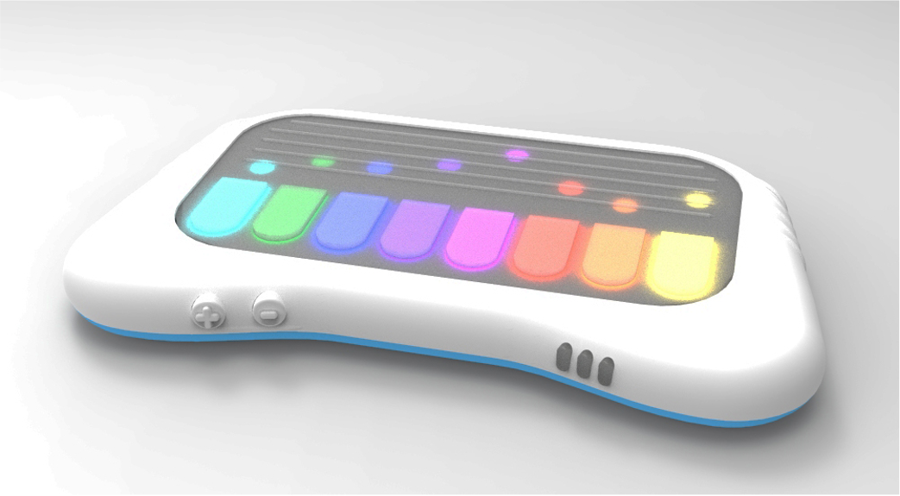

# Preface

[GUIDO](https://chi.camp/projects/team-ge/) is part of China Hardware Innocation Camp [CHIC](https://chi.camp/) program from [EPFL](https://www.epfl.ch/education/educational-initiatives/fr/discovery-learning-program/projets-interdisciplinaires/chic/). Hosted by the College of Humanities and offered as a Minor, CHIC challenges students to go from a blank sheet of paper to the functional prototype of a connected device.

Students from EPFL (engineering, computer science, etc.) work in cross-functional teams with students from ECAL (industrial design and media interaction design) and UNIL (business and information systems). They develop skills related to user-centric design, interdisciplinary team work, applied project management and intercultural communication. In 2015, CHIC opened the doors of University of Applied Sciences and Arts of Western Switzerland which include multiple institutions such as HEPIA, HEG, HEIG-VD, etc. This is how I could do such journey. 

During the Fall semester, teams identify an opportunity space. In Spring, they prototype their solution. During the summer they fly to Southern China (Shenzhen and Hong Kong) to finalize the devices at a local prototyper’s factory (Seeedstudio) and pitch their projects in front of incubators, accelerators and Chinese makers. In my case, the last 3 months were considered as my Bachelor thesis. From fall to summer semester, we had several ideas and did several prototypes before identify the opportunity of a music learning tool.

# Introduction

GUIDO is an educational tool designed to make music homework fun. Its goal is to replace parents by supervising in real-time the exercises assigned by the teacher. Guido is an autonomous, robust, and durable device that allows the playing of multiple instruments and is sure to engage children by offering a variety of exercises created by music teachers themselves. Teachers can create exercises through a desktop application and make them available to their students. Parents can then download the exercises into the instrument via an app.

 

Three engineers worked on the project and divded the work like this:

* Engineer #1: reponsible for the LED matrix, MCU choice, Bluetooth and RF antenna
* Engineer #2: reponsible for the touchscreen, mobile App and memory 
* Engineer #3 (me): responsible fo audio, web server, electronic and power design

The main architecture of the wall system looks like this:

 

# Power rail

The goal was to recharge our device with USB Type-C and being fully compatible with the Power Delivery protocol. GUIDO’s power supply is a crucial aspect because, with the various integrated components and features, power consumption is high. The largest power consumer is the LED matrix. In fact, on average the consumption is around 2.5 amps. At maximum consumption, it should not exceed 6-7 amps. We assume 10 amps to be larger. The other major power consumer is the audio amplifier that can drain up to 1.2 amps. Here is an overview of the power part of this project.

 

# Audio

Since the mid-20th century, music has undergone significant changes due to the emergence of audio synthesis. We'll not deep in different kind of audio synthesis, but there is a bunch of method to do it like additive, subtractive, frequency modulation, granular, wavetable, vectors, sample-based, etc. As the goal of the project was to made a functional prototype and we didn't have time to experiment all the methods, we decided to use the sample-based synthesis method. This method uses a seed waveform that is a sampled sound which makes it easy to implement and it seperate the device from the sound making. At the end, the sounds could just be WAVE files registered in a SD card. That's exactly what we did. The resulting audio circuit is quite simple as you can see below.

 

Here is the different parts of the audio module. The logic of this part is described below. 

 

And here is the interrupt function logic for the I2S device. 

 

The diagram above represents the interrupt function of the I2S peripheral. The overall operation of the program is based on two buffers. One is filled when reading data from the SD card, and the other is used by the I2S peripheral to send data to the DAC. While the I2S sends the values contained in one of the buffers, data is read into the other. When there is an I2S interrupt, the buffers are swapped. It is important that data reading is faster than data transmission because when the I2S interrupt occurs, it means that the I2S peripheral is almost finished sending the buffer.

# SD Card

To play a sound, it must be read and stored. For storage, an SD card is used. The advantages are numerous. First, the capacity of SD cards is very appealing: up to 128 GB for common cards and up to 512 GB for very large capacities. This allows for the storage of a vast number of samples, even with basic cards of just a few gigabytes. Additionally, since WAV files are memory-intensive, it is preferable to have sufficient storage space. They are not too bulky and can be easily swapped in case of malfunction. SD cards can also contain a file system, and there are numerous examples online illustrating this. Moreover, for research, development, and testing with users, it is very easy to change sounds using a computer. You can even ask a school or an artist to provide a set of digital instruments or sounds to copy into Guido. This greatly facilitates interaction UX research. We choose to use the very common FAT32 FS because all main OS support it. The simplest way to do it is to import an existing project like [FatFS](http://elm-chan.org/fsw/ff/00index_e.html) and code the low level libraries (in green) needed as shown on the picture below. 

 

# Conclusion

The Bachelor’s project faced several challenges, including delays from an error with the first sound card and issues with the nRF52840 ports and SD card reading speed during chord playback. Balancing the needs of the CHIC community with academic requirements also complicated matters, resulting in time-consuming discussions about the business model which gets me to give up setting any kind of server. On the other hand, the journey was amazing and an awesome experience that give us the opportunity to assess our skills and learned a lot in a multidisciplinary context. Whether from a business, project management or design point of view, I have never learned so much in one year long. 

GUIDO's first light 

PCB assembly by hands
