# Introduction 
Field Programmable Gate Arrays (FPGAs) have become a vital tool in the realm of digital design, offering the flexibility of software with the performance advantages of hardware. Here, I explored the use of a FPGA to compute the Mandelbrot set. I made this for LPSC course @ [HES-SO](https://www.hes-so.ch/master/hes-so-master/formations/engineering). The purpose of this project is to design a component capable of performing the calculations required to display the Mandelbrot set. Then, we had to choose one (or many) of the following improvements:

* Management of a larger fractal size using external DDR memory
* Enhanced fractal precision by working with larger fixed-point numbers and integrating a pipeline into the calculation block to increase computation speed. Performance analysis and resource usage based on different sizes
* Enhanced fractal precision by working with floating-point numbers and analyzing resource usage and performance
* Parallel execution of calculations by replicating multiple identical calculation blocks
* Data transmission via optical fiber between two boards (subject to hardware availability)

[This post delves into the mathematical intricacies of the Mandelbrot set, the design choices for implementing calculations on an FPGA, and the challenges of managing precision and performance.]: #

# Mandelbrot

The basic equation for the **Mandelbrot set** is:

$$ Z_{n+1} = Z_n^2 + C $$

where:

- **Z** is a complex number in the form ***z = x + yi*** (where **x** and **y** are real numbers, and **i** is the imaginary unit).
- **C** is a constant complex number representing a point in the complex plane.
- **$$Z_{0}$$** is initially set to 0 .

For each point **C**, the iteration continues until **$$Z_{n}$$** exceeds a predefined boundary. A maximum number of iterations is defined, and if this number is reached without **Z** exceeding the circle with a radius of 2, the number of iterations returned will be 0. In all other cases, the **Z** resulting from the last iteration will be returned to properly display the curve. The color of each point on the display can be determined by the number of iterations required for **Z** to escape. 

This iterative nature makes the Mandelbrot set computationally intensive, as it involves numerous complex multiplications and additions. Implementing this on a FPGA allows for parallel computations, significantly speeding up the process. For more information, please see: [https://en.wikipedia.org/wiki/Mandelbrot_set](https://en.wikipedia.org/wiki/Mandelbrot_set)

# Breakdown

Each step can be done in a combinatorial manner, with the registers serving only to store the current state of the calculation. For a clearer understanding of how the Mandelbrot calculation is performed, below is a block diagram outlining its various components:

<p align="center">
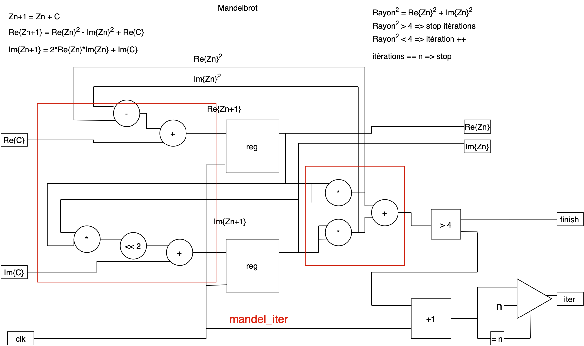 
</p>

Two blocks are described in VHDL. The lowest level is *mandel_iter*, which contains only the raw calculation. The next level up is *mandelbrot_calculator*, which includes elements for inputting data for the calculation. It also contains control elements, such as a state machine.

# Entity

In the context of hardware like FPGAs, handling complex numbers and iterative calculations requires precise management of numerical representation. For this project, fixed-point arithmetic was chosen over floating-point due to its lower resource consumption and simpler implementation on FPGA hardware.

For this project, the folowing entity was proposed:

```vhdl
entity mandelbrot_calculator is 
generic (
  comma : integer := 12; --number of bits after comma
  max_iter : integer := 100;
  SIZE : integer := 16);
port(
  clk : in std_logic;
  rst : in std_logic;
  ready : out std_logic;    
  start : in std_logic;     
  finished : out std_logic; 
  c_real : in std_logic_vector(SIZE-1 downto 0);
  c_imaginary : in std_logic_vector(SIZE-1 downto 0);
  z_real : out std_logic_vector(SIZE-1 downto 0);
  z_imaginary : out std_logic_vector(SIZE-1 downto 0);
  iterations : out std_logic_vector(SIZE-1 downto 0)
);
end mandelbrot_calculator;
```

And here is a basic block diagram of the entity:

<p align="center">
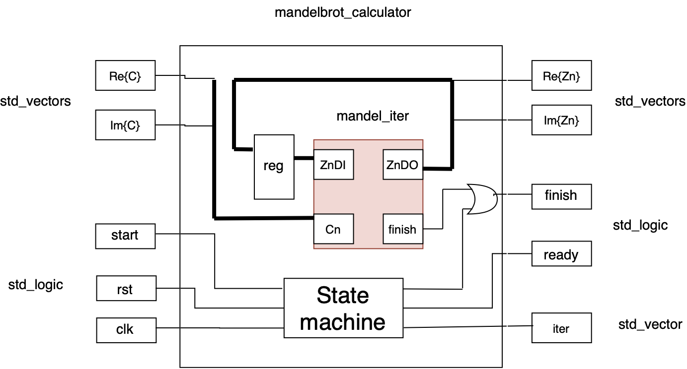 
</p>

We can see how the signals are wired. While this block diagram is not
detailed, it provides information on how the VHDL entity operates. The state machine manages the control signals (*start*, *ready* and *finish*) and oversees the handling of the different calculation iterations.

Here is the principe of the state machine: 

<p align="center">
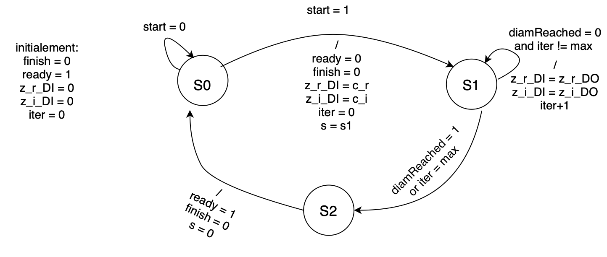 
</p>

The state machine manages Mandelbrot calculator's logic, and status signals. State *S1* will repeat until it reaches the maximum number of iteration or the maximum diameter. A testbench was made to ensure that the design is working well, and then a full system block diagram:

<p align="center">
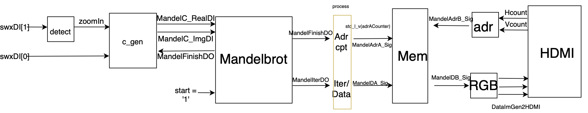 
</p>

The switch *swxDI[0]* enables a zoom out, restoring the original Mandelbrot image. When *swxDI[1]* is pressed (triggered on rising edge), the *zoomIn* signal is toggled, initiating a zoom animation. This animation is controlled by a process that generates a signal at the *zoomIn* input of *c_gen*.

The Mandelbrot calculator requests complex number values from *c_gen* each time a pixel computation is completed, indicated by the *MandelFinishDO* output signal.

A process is responsible for incrementing the memory address each time the calculator finishes computing a pixel. The counter counts up to 614,400 (1024x600 resolution) and then resets. Additionally, this process maps the number of iterations to a value to be stored in memory. In essence, this is merely an adjustment of data size. On the memory output, there is a straightforward mapping to obtain an RGB value, along with a conversion of Hcount and Vcount into a corresponding memory address.

Here is the RTL design done by Vivado:

<p align="center">
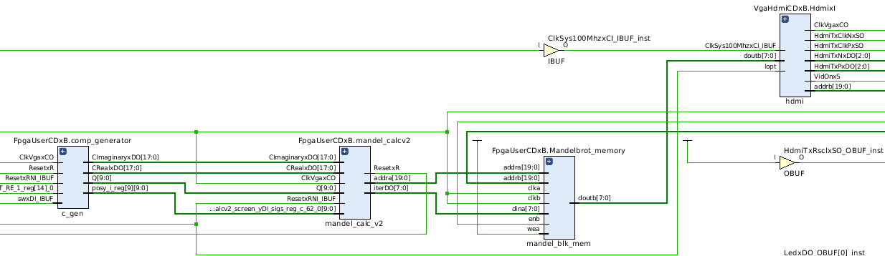 
</p>

Here are some performance metrics from the initial implementation of the Mandelbrot calculator:

<p align="center">
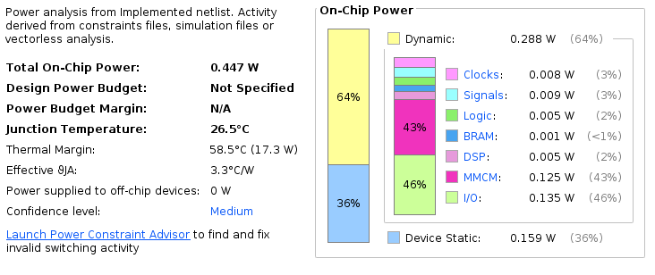 
</p>
<p align="center">
Above is the power consumption for each type of component.
</p>

<p align="center">
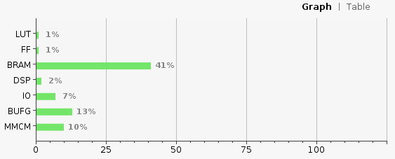 
</p>

<p align="center">
The utilization of different part of the FPGA. 
</p>

<p align="center">
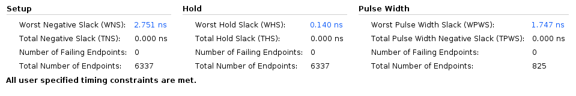 
</p>


Above are the two timing **Worst Negative Slack** and **Worst Hold Slack**. These two ensure that the system operates correctly and on time:

- **WHS** ensures that signals stay stable long enough for the system to read them correctly. If negative, it can cause unstable operations due to incorrect data being latched.
- **WNS** guarantees that signals arrive on time, so the system has enough time to process them before the next action. If negative, it leads to timing violations, causing signals to arrive to late, which can result in incorrect computations, glitches, or FPGA's failure. 

# Pipelines

The initial performance was unsatisfactory, as the calculations were relatively slow and, more importantly, non-deterministic due to the varying number of iterations. To improve this, a pipelined system was implemented with the same number of calculators as the maximum number of iterations. Here is the idea:

<p align="center">
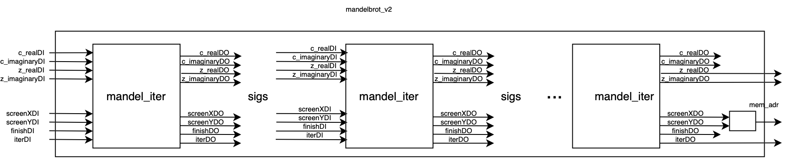 
</p>

The *mandel_iter* circuits were chained together and interconnected using signals. Screen position, completion, and iteration signals were added. The screen position, provided by *c_gen*, is transmitted from block to block, along with the initial complex values. This allows each calculation to be passed sequentially through the blocks.

Each block increments the iteration value as it performs a calculation. If a calculation is complete, the finish signal of the current block is set to **1**. Subsequent blocks do not perform additional calculations but simply pass the result to the next block. At the *Mandelbrot* circuit level, the addition is that the circuit is ensuring proper mapping between the blocks and updating inputs based on the outputs from the previous stages. Very few differences were made at this level.

This system can be viewed as a shift register, where each shift either performs or bypasses a calculation before passing it along. The advantage of this setup is that one pixel is calculated per clock cycle, except during the initial setup cycles.

<p align="center">
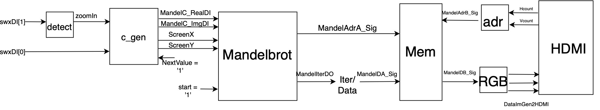 
</p>

This is the complete system in its second version. In this configuration, *c_gen* provides a value with every clock cycle, unlike the first version where it had to wait for the *Mandelbrot* circuit to complete. With *Mandelbrot* now holding the pixel positions, it directly calculates the memory address, eliminating the need for a separate process to handle this task. Also, instead of doing the calculation directly in the *mandel_iter* design, it's know done with DSP48 block. For example, instead of this:

```vhdl
re_zn2 <= std_logic_vector(signed(z_realDI) * signed(z_realDI));
```

I choose to use this:

```vhdl
square_re_zn: dsp_simple 
    port map(
        A => z_realDI,
        B => z_realDI,
        P => re_zn2
    );  
```

Beyond the learning aspect, there are several advantages to using DSP48: 

- High performance: it's optimized for fast arithmetic operations
- Resource saving: offloads computation from general logic (e.g. addition, multiplication,...)
- Pipelined architecture: enables high throughput and faster clock speed
- Reducing power consumption: using dedicated DSP IPs is more efficient thant implementing the same operations using general FPGA resources

Here, we can see the difference with the first design:

<p align="center">
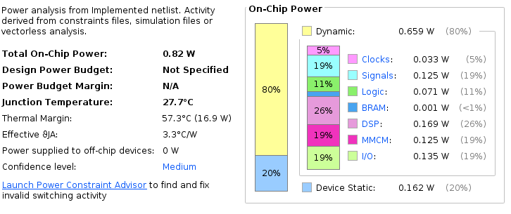 
</p>

The power consumption is greater than first release of Mandelbrot calculation. This is mostly due to the use of DSPs and more logical elements as you can see below:

<p align="center">
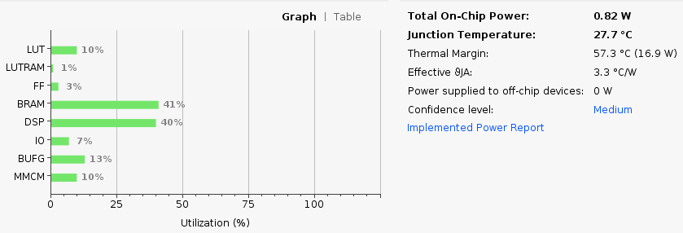 
</p>

We can also see the difference with **WHS**:

<p align="center">
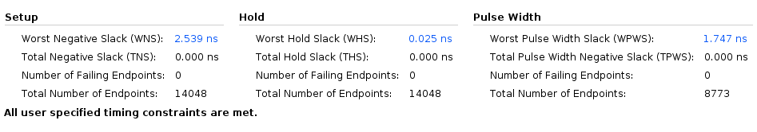 
</p>

# Conclusion

The development of an FPGA-based Mandelbrot set calculator has successfully demonstrated the powerful capabilities of FPGAs in handling complex iterative computations, such as fractal generation. By utilizing fixed-point arithmetic and a pipelined architecture, the project achieved both precision and efficiency in rendering the Mandelbrot set.
The implementation of the *mandelbrot_calculator* and its interaction with external components, such as the memory interface and VGA controller, allowed for seamless real-time fractal visualization. The use of hardware resources was optimized through careful management of bit-widths and control signals, ensuring high performance while minimizing resource consumption. This project was highly insightful in terms of practical experience with FPGA tools and hardware. Working with the Vivado offered a deep understanding of design synthesis, implementation, and hardware debugging. For more information, source code available here: [https://github.com/mekiisupertramp/fpga_mandelbrot/tree/master](https://github.com/mekiisupertramp/fpga_mandelbrot/tree/master)