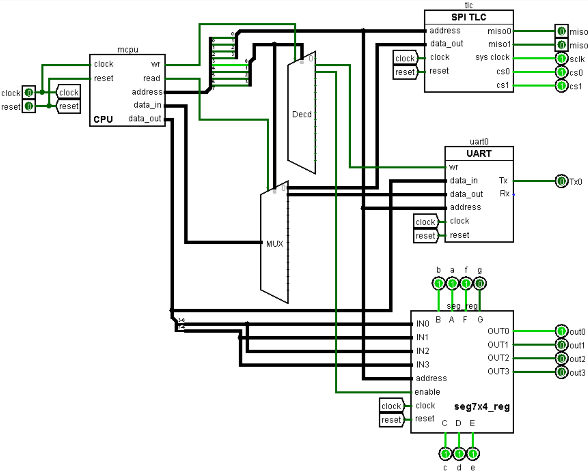

# Introduction 
The project involved the design and implementation of a remotely controlled robotic system integrating logical design principles, embedded systems, and electronic components. This endeavor aimed to apply theoretical concepts taught in classes and laboratories while addressing practical challenges in interfacing analog and digital systems.
The system utilizes an FPGA-based platform ([Basys2](https://digilent.com/reference/programmable-logic/basys-2/start?srsltid=AfmBOopXnU4HOjLnr6OfDLr5oW5NZBnwHhMqE_pyYuIe14Ph9G5rxgfl) board) to manage functionalities such as motor control, sensor data processing, and real-time communication. Here isn't any VHDL code, only designed part using [Logisim](https://www.cburch.com/logisim/), and a custom compiler written in Python to compile instructions set into OPCODEs. The robot is equipped with infrared distance sensors to detect proximity, which interface with analog-to-digital converters for numerical processing, and motor drivers to enable movement based on proximity data. Initially, communication between the control and motor modules was designed to function through a wireless connection using Wifly RN-134 modules. However, performance limitations and latency issues necessitated the adoption of a wired UART communication method. The project emphasizes the integration of analog and digital components, control logic design, and the practical implementation of hardware systems.

 

Commands (left) & robot (right)

# System overview
This section outlines the circuits created using Logisim. As part of the project, two circuits and two different sets of instructions were designed: one intended for controlling the Basys boards dedicated to commands, and the other for managing the motor control (robot).

## Commands

This circuit consists of a processor, an SPI interface for the TLC548, a UART interface for transmitting distance data to the robot, and an interface for displaying distance measurements on the 7-segment display of the Basys (the first two digits correspond to the first infrared sensor, and the other two to the second sensor). The circuit includes four inputs: the 50 MHz clock signal from the Basys2 board, a reset signal (triggered by a button), and two 1-bit digital inputs from the TLC548. Additionally, it features 15 outputs, all 1-bit: the clock and two chip-select signals for the TLC548, the UART transmission signal, four selectors for the 7-segment display, and seven outputs corresponding to the segments (labeled A to G).

 

Commands' MCU

## Robot
This part is composed of a processor, a UART interface for receiving distance data from the commands board, two PWM interfaces for controlling the two motorized wheels, and an interface for displaying distance measurements on the 7-segment display of the board (the first two digits correspond to the first infrared sensor, and the other two to the second sensor).
The circuit includes three inputs: the 50 MHz clock signal from the Basys2 board, a reset signal triggered by a button, and a UART data reception input from the other board. All inputs are 1-bit signals. The circuit also provides 17 outputs, each 1-bit: two constant chip-select signals for the H-bridge (set to zero), four output signals for controlling the direction of motor rotation (two per motor), four selectors for the 7-segment display, and seven signals corresponding to the display segments (labeled A to G).

 

Robot's MCU

# CPU

The processor utilized in this project was designed using Logisim. It consists of an ALU (Arithmetic Logic Unit) developed during the first semester, a ROM-based instruction memory, and a register bank serving as a cache for the ALU's computational data. The entire system is managed by a control unit, implemented as a state machine that decodes instructions and directs the operations of the ALU and register bank. Instruction sequencing is achieved through an 8-bit counter. Beyond the ALU operations, the processor supports loading constants into a register within the register bank and performing conditional or unconditional instruction jumps. Conditional jumps are executed based on the flag values set by the computation in the instruction preceding the jump.
The processor includes three inputs: a 1-bit clock signal from the Basys2 board, a 1-bit system reset, and an 8-bit input for peripheral device data. Additionally, it provides four outputs: a 1-bit read signal and a 1-bit write signal to indicate a read or write operation to peripherals, an 8-bit output for transmitting data to peripherals, and an 8-bit output representing the address of the peripheral and its potential internal registers. The upper 4 bits of this address are used to select the target peripheral during a write operation, while the lower 4 bits specify the internal registers. For read operations, the internal registers are selected, and the data is retrieved accordingly.

 

CPU

## ALU
The Arithmetic Logic Unit (ALU) is the computational heart of any processor, designed to execute both arithmetic operations, such as addition and subtraction, and logical operations, like AND, OR, and XOR. Here is the complete instruction set we need in this project to make our CPU work:

 

ALU's instructions

As a fundamental building block of digital systems, it processes binary data and serves as a critical component within the larger architecture of a CPU. Controlled by the processor's control unit, the ALU performs operations based on instructions and control signals, directly influencing the efficiency and functionality of the entire system. Its design and capabilities are central to the performance of modern computing devices.
In this project, the ALU includes three inputs: two 8-bit inputs, A and B, which serve as the operands, and a 3-bit opcode input used to select the desired operation. It features outputs such as an 8-bit result output and four 1-bit flags (Z, N, C, V), which respectively indicate whether the result is zero, negative, has a carry, or an overflow occurred. The four flags can also be accessed via a 4-bit flag bus, arranged in the order ZNCV (from MSB to LSB). 

 

ALU simple

Above is the implementation of a simple ALU, allowing the first two instructions, and perform flag operations. Below is the complete ALU allowing the remaining instructions to be performed. 

 

ALU complete

## Registers
To store the results from the ALU and data from peripherals, the processor requires memory in the form of a register bank. This register bank consists of eight registers, an address decoder, and two multiplexers to manage output selection. Basically, it's the RAM memory. Needed by a program to store variables for example. It includes seven inputs: a clock signal, a reset signal, a write enable input to indicate a write operation, a 3-bit address input to select the appropriate register, an 8-bit data input for the data to be written, and two 3-bit inputs to select which data to read (allowing simultaneous reading of two values). Additionally, it features two 8-bit outputs for reading data. 

 

Registers

## Control unit

To coordinate the various components, the processor is equipped with a control unit, which is purely combinational in design. This unit receives 16-bit instructions and decodes them by splitting the 16 bits to generate the required control signals at the appropriate times. It has five inputs: a 16-bit instruction input, the 8-bit result from the ALU, 8-bit data from peripherals, an 8-bit program counter, and a 4-bit flags input (ZNCV). The unit produces 12 outputs, including the 3-bit operation code for the ALU, the write address and two read addresses (each 3 bits) for the register bank, an 8-bit data output for the register bank, an 8-bit jump condition and load signal for the program counter, an 8-bit address output for peripherals, and associated read and write control signals.

 

Control unit

## Instructions memory

The instruction memory receives the 8-bit value from the instruction counter and selects the corresponding instruction using multiplexers. The selected instruction is then output as a 16-bit value. Basically, a program is stored there. Instructions are generated through an instruction generator (described below).

 

Instructions memory

# Peripherals

Dedicated interfaces were designed to enable communication with various electronic components. All inputs and outputs are logically inverted, as they are reversed again by the Basys2 system. These interfaces function similarly to an MCU's interface and facilitate communication between the CPU and components. Both robot & command parts have:

- A 7-seg driver to debug values sent/received
- UART interfaces for communication
- SPI for distance sensor (TLC548 + infrared sensors, only command)
- PWM for H-bridges (only robot)

## Distance sensor (SPI TLC)
The distance measurement is made by infrared sensors in adition to TLC548 ADC-to-SPI converter. This interface communicates with two TLC548 analog-to-digital converters. It consists of two counters (6-bit and 5-bit), two shift registers, and two associated 8-bit registers to receive digital data, along with various comparators and multiplexers. The interface includes five inputs: a clock signal, a reset signal, a 4-bit address to select the internal registers, and two 1-bit digital data inputs (MISO 0 and 1) for serial communication. Additionally, the interface generates three outputs: a 1 MHz clock and two chip select signals for the TLC548 converters. Here is the interface's internal: 

 

SPI TLC interface

In the schematic below, you see how the interface (Basys2, SPI TLC) is connected to the external devices (TLC548 + infrared sensors). 

 

Distance measurement schematic

## Half H driver (PWM)

The PWM interface is required to control the H-bridge. The concept is straightforward: a pulse is generated with a duty cycle proportional to the transmitted 8-bit value. The interface consists of two counters, an 8-bit data register, a 1-bit register for the rotation direction, and a comparator that matches the current counter value with the received data. It includes five inputs: clock and reset signals, an enable input for writing, a selection address for the rotation direction, and the 8-bit data to be stored in the register. The interface provides three 1-bit outputs: a constant chip select signal set to zero (as a precaution) and the two rotation directions.

 

PWM interface internal

## 7-seg (seg7x4_reg)

This interface was originally designed for a previous logic systems lab and was later refined and improved for this project. It includes eight inputs: clock, reset, write enable, a 4-bit address for register selection, and four 4-bit data inputs for binary-to-hexadecimal conversion. The interface provides eleven 1-bit outputs: seven segments of a display and four outputs for selecting the appropriate display among the four available on the Basys2 board. A dedicated subcomponent, *binTo7seg*, is utilized for displaying hexadecimal values. The first two digits display the values from the first infrared sensor, while the next two digits display the values from the second sensor.

 

7-seg interface

## Wifi (UART)

This UART interface is more complex than others due to the intrinsic constraints of UART communication. It includes six inputs: clock and reset signals, write enable, a 4-bit address for internal registers, an 8-bit data input for transmission, and a 1-bit reception input. It provides two outputs: an 8-bit data output for received data and a 1-bit transmission output. The interface is divided into two sections: transmission and reception. Both transmission and reception operate at 9600 baud, using 8 bits, no parity, one start bit, and one stop bit. A shift register is used to handle the 8-bit data to be transmitted. Transmission is initialized by performing an initial write operation. Once a complete frame has been transmitted, new data can then be sent. Until the transmission is complete, a signal prevents the processor from writing additional data. A similar mechanism is implemented for reception. During reception, a counter manages the calculation of the 1.5 start bits. To determine which motor the data is intended for, an identification frame is transmitted first (see Instructions).

UART BUT WIFI BUT UART ....... EXPLAIN IT!

# Instructions
## Commands
## Robot
# Conclusion
