# Introduction 

This project involved transforming a commercial RC drift car into a more advanced and feature-rich RC machine. The primary goal was to implement an anti-skid system using sensors such as an accelerometer and a speed sensor, allowing the car to minimize wheel slippage effectively.

The car was also equipped with a Bluetooth module for control through a smartphone running Android. Users could control the car intuitively by tilting the phone, with real-time data such as speed and battery status displayed on the UI. Additionally, the system included an SD card module for data logging, enabling the recording of operational metrics for analysis.

# Platform

One important part of this project includes studing the car. This included understanding its mechanical components as well as its embedded systems. Various measurements were conducted, such as the car's overall power consumption, motor output, control signals for motor operation, and the wheel rotation angles.

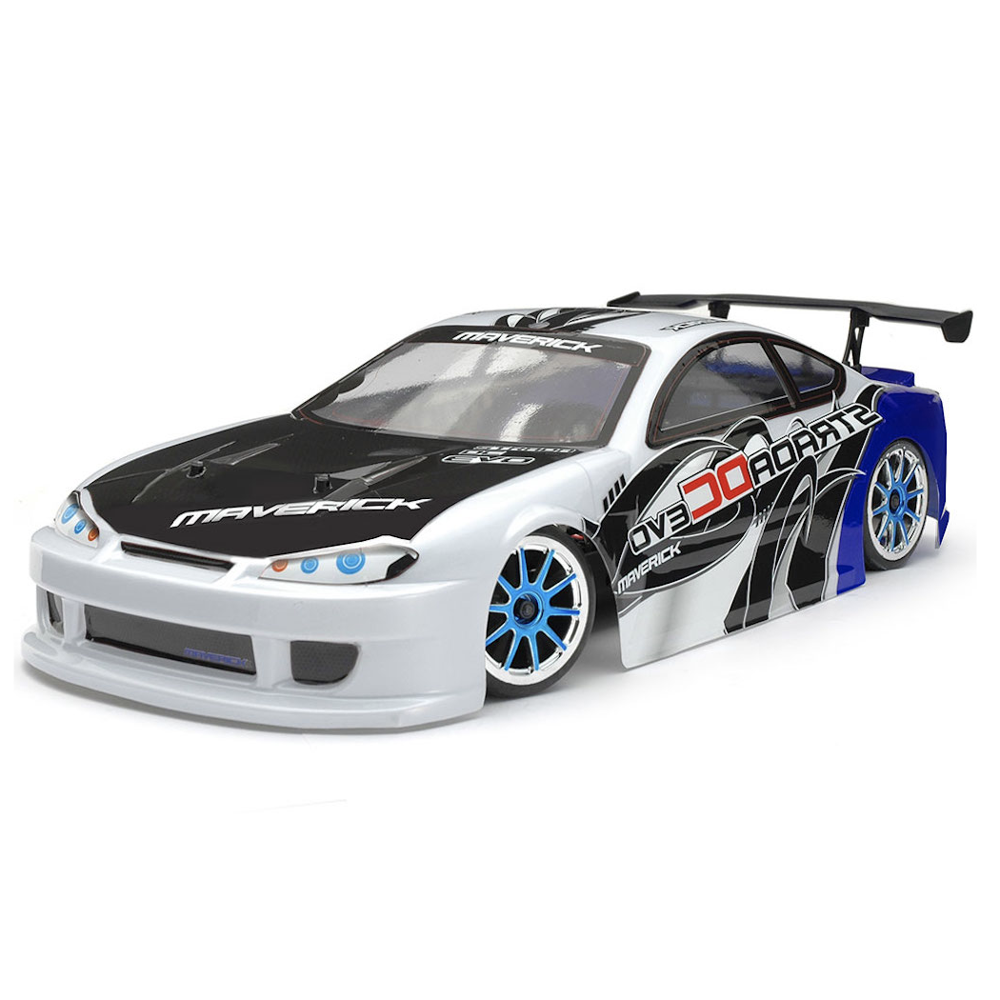 

The car was analyzed in sufficient detail to ensure that it could be easily understood and utilized by others in the future. The model used for this project is the "Maverick Strada DC Evo," and its design reflects the complexity and functionality explored throughout the study. Below is several car's informations, and measures.

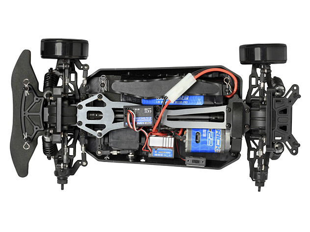 

Car's frame

Interestingly, the RC model utilizes a differential between the front and rear wheels, similar to a standard car. Running along the center of the car is the axle, which transmits power from the motor (the blue component in the bottom right of the frame) to the wheels.

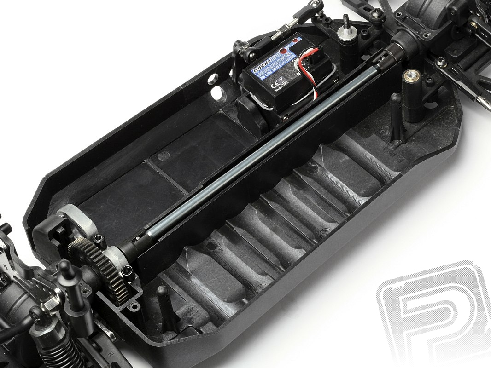 

Model's axle

The direction is driven by a servomotor.

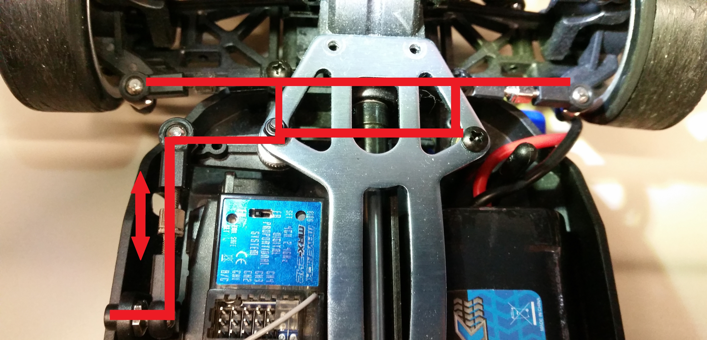 

Direction system

The car's control system relies on a 4-channel 2.4GHz receiver, which communicates with the remote control to operate the motors. The receiver, powered by the motor controller's 5V supply, interprets command signals from the remote and controls the servomotor and main motor via pulse width modulation (PWM). The PWM's width ranging from 1 to 2 milliseconds, determines the servomotor's angle and the main motor's behavior. This receiver is replaced by a custom electronic board.

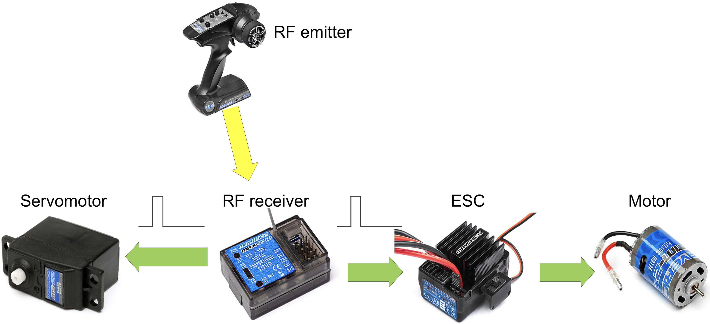 

System's summary

# Diagrams
Here is a brief summary diagrams of the project. The goal is turning this:

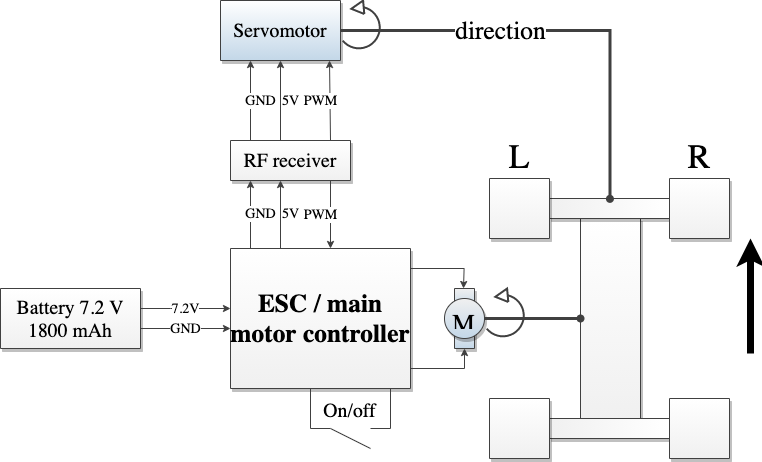 

Base diagram

Into this:

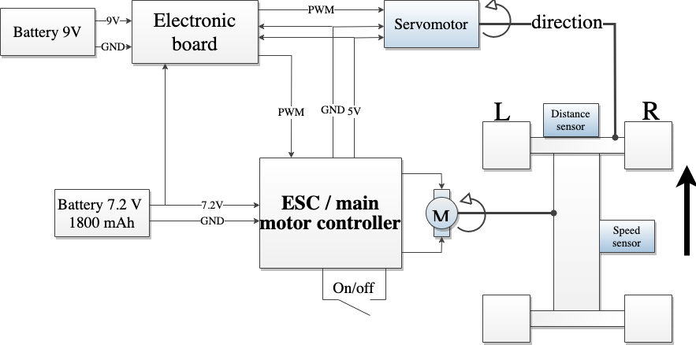 

Modified diagram

The purpose is to replace the RF receiver with the electronic board. In addition, it's necessary to modify the platform to add sensors. Other parts doesn't need to be replaced.

# Control

Replacing the RF receiver by a custom PCB enhances functionality and safety. A microcontroller handles overall system management, while an accelerometer and speed sensor form the core of the anti-skid system, ensuring stable performances. A distance sensor is integrated to prevent collisions, and remote control capabilities are enabled through a Bluetooth module. 

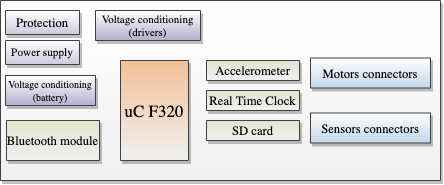 

PCB main parts

Additional features include provisions for an SD card for data logging and a Real-Time Clock for time management. A dedicated Android application serves as the car’s remote interface, allowing seamless control via smartphone.

The microcontroller used for this project is the C8051F320 from Silicon Laboratories. This MCU is an 8-bit microcontroller featuring a high-speed 8051 core with integrated full-speed USB 2.0 support. It operates at up to 48 MHz, offering significantly higher performance than standard 8051 MCUs. Although this microcontroller is old, it remains versatile and has enough peripherals to operate as expected.  

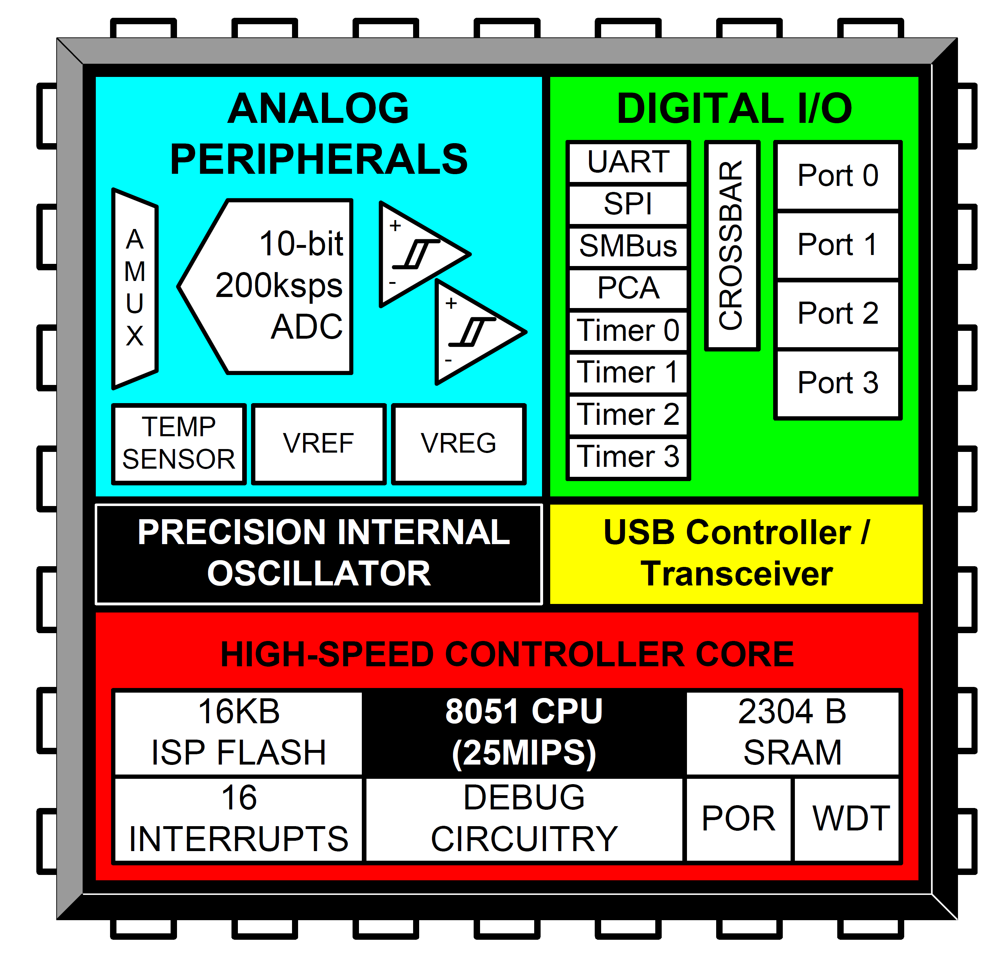 

C8051F320 features

# Bluetooth module

The ARF7044 Bluetooth module, manufactured by Adeunis RF, is a Bluetooth 2.0 device designed for seamless communication between a microcontroller and a smartphone. It bridges serial (*UART*) and Bluetooth communication, supporting wireless transmission speeds of up to 723 kbps with an integrated antenna. Equipped with an EEPROM and two clock sources, the module offers flexibility in embedded applications.

The module is simple to use, requiring only power to operate. Once connected via Bluetooth, it becomes "transparent" to the connected devices, allowing smooth data exchange. Despite its advantages, the ARF7044 presents challenges, including its obsolete status, which complicates access to documentation, and a less common connector design. While it supports SMD mounting, using a 2 mm header pin simplifies installation and removal, especially for prototyping.

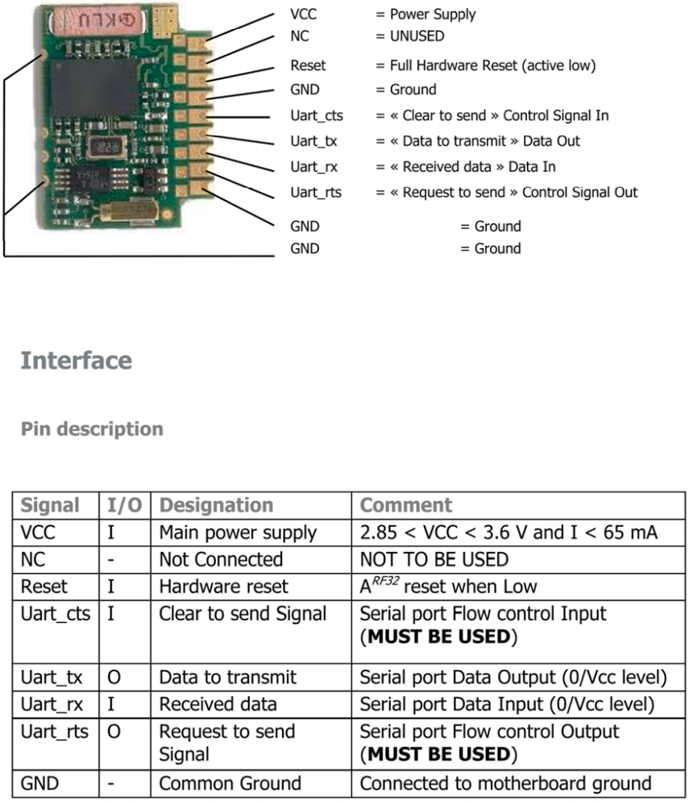 

Bluetooth module

# Apps functions

The application has been developed to operate on a Samsung Galaxy S5 running Android 5. The development language was Java within Android Studio. To facilitate understanding of the App's architecture, here is a class diagram that illustrates the various system components.

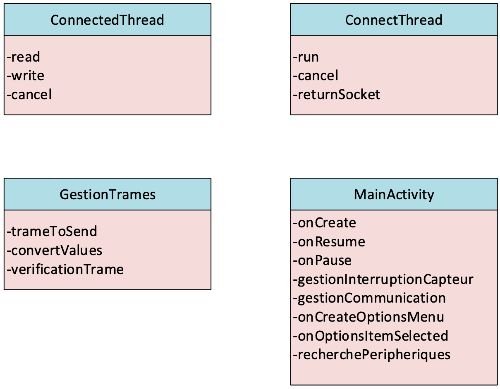 

Principal class

The **MainActivity** is the primary class in the application, responsible for managing user interface interactions and core functionality. Here's a summary of its role in the overall application architecture:

- UI management: Handles the creation and interaction with the application's main interface.
- Lifecycle management: Manages the application's lifecycle events, including creation, resumption, and pausing.
- Sensor handling: Sets up and manages sensor interrupts for device orientation and movement detection.
- Communication management: Handles communication with external devices.
- Menu creation and interaction: Creates and manages the options menu and its selections.
- Device Discovery: Manages the search for and listing of peripheral devices, likely for Bluetooth connections.

The class serves as the central hub for the application, coordinating various components and functionalities. **ConnectThread** establishes a Bluetooth connection between the smartphone and the module. It implements threads for non-blocking operation, and manages the Bluetooth socket. **ConnectedThread** manages the communication once it's connected. This class handles both sending and receiving datas. Also, it needs **GestionTrames** for datas format. 

# Apps UI 

The application boasts a streamlined and user-friendly interface, designed to provide real-time feedback on vehicle dynamics. At its core, a dynamic sphere visualizes the smartphone's tilt, which is sent to the car's steering input. This control allows user to steer the vehicle by tilting his phone, offering an intuitive and engaging driving experience.

Key features of the UI include:

- G-Force visualization:  A sphere moves within a circular boundary, reflecting the current tilt of the smartphone. This view helps user understand how his phone's orientation is being interpreted as steering input for the car.

- Speed: The *vitesse* indicator shows the car's current speed in kilometers per hour. Upon successful connection to the Bluetooth module, this display initializes at *00*.

- Drive Control: A *Drive* button serves as the primary control for initiating vehicle movement. Users must engage this button to activate the car's motion and then tilt the phone to the desired direction. 

- Connectivity Options: To establish a connection with the Bluetooth module, user can access the options menu via the three-dot icon at the upper-right corner.

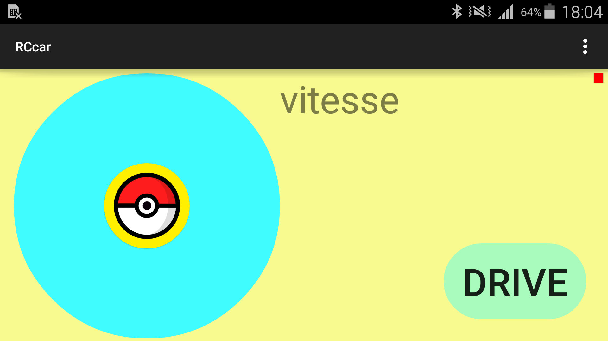 

App's UI

# Anti-skid system

As mentioned, the anti-skid system is made possible by the integration of a speed sensor and and accelerometer. The first one is a ZX-03 infrared reflection sensor module commonly used in robotics for object detection and line-following applications. It integrates a TCRT5000 sensor, which combines an infrared LED and a phototransistor in a single package. This sensor is placed above the vehicle axle as folows:

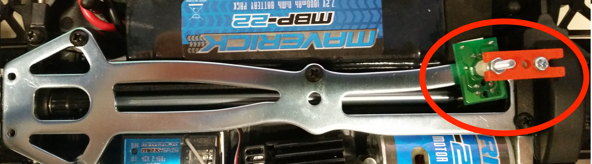 

Speed sensor

The second sensor is the ADXL335 from Analog Devices. It's a small, low-power, 3-axis accelerometer. It measures acceleration in the X, Y, and Z axes and provides analog voltage outputs proportional to the acceleration detected. This sensor is widely used in robotics, drones, and automotive systems due to its simplicity and robustness. Since it outputs analog signals, it can easily interface with microcontrollers and ADCs (Analog-to-Digital Converters) for further processing.

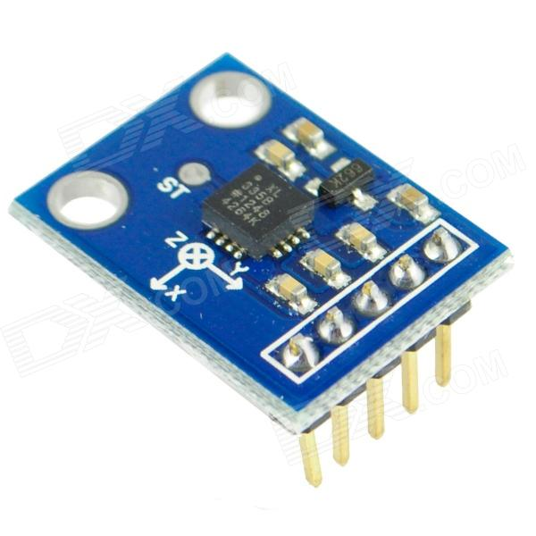 

Accelerometer

# Distance sensor

To enhance the safety of the car, a GP2D120 distance sensor was integrated to stop the vehicle when obstacles are detected. The sensor is calibrated to block the wheels when an object is within 15 centimeters. Due to its response curve, precautions are taken for objects closer than 3 centimeters by comparing current and previous distance values in the microcontroller. 

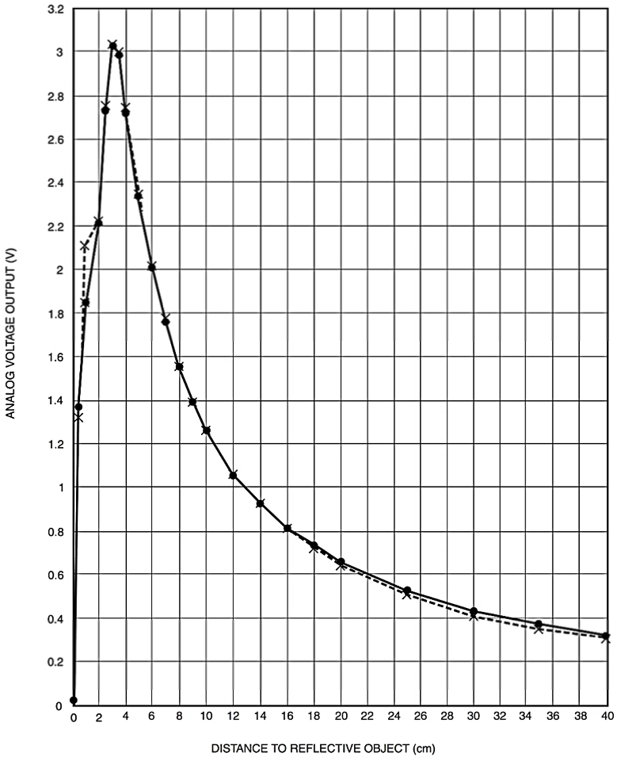 

Distance sensor reponse curve

Alternatively, the sensor is positioned slightly farther back to avoid problematic ranges. The prototype design includes a basic adjustment to the car's body to accommodate the sensor, though this would require refinement for a commercial model. Currently, the car stops at 22 centimeters, factoring in the sensor’s position, with potential for further adjustment.

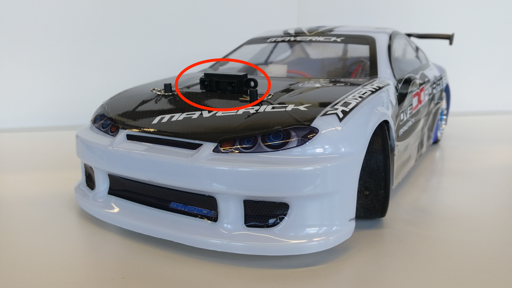 

Sensor position

# Conclusion

While the main constraint was designing a compact electronic control system to fit within the car’s model, the project successfully integrated analog, digital, and power electronics into a practical and entertaining device. This project highlights the application of engineering principles to create a user-friendly product for the general public. For more informations please see: [https://github.com/mekiisupertramp/rccar](https://github.com/mekiisupertramp/rccar). A complete and detailed report (in french!) can be found here: [https://github.com/mekiisupertramp/rccar/blob/main/report-french.pdf](https://github.com/mekiisupertramp/rccar/blob/main/report-french.pdf). Here is also a demo video: [https://github.com/mekiisupertramp/rccar/blob/main/demo.mp4](https://github.com/mekiisupertramp/rccar/blob/main/demo.mp4)

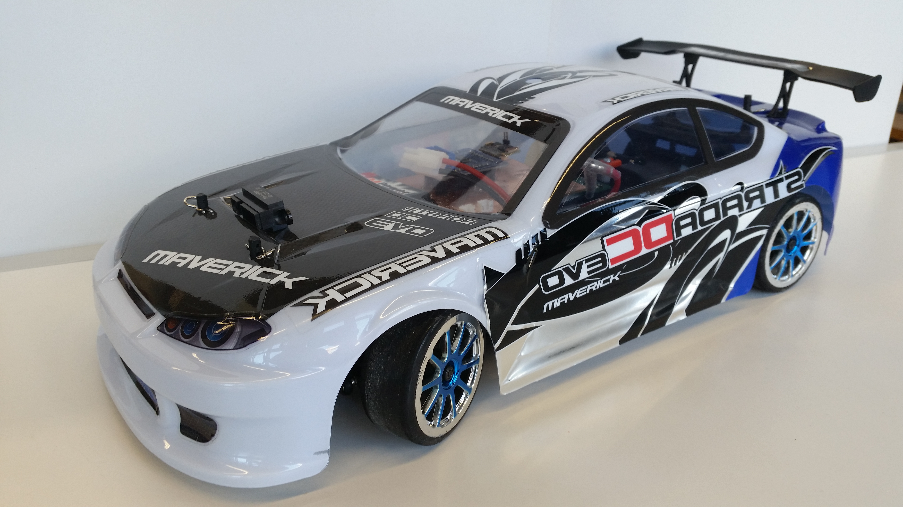 

