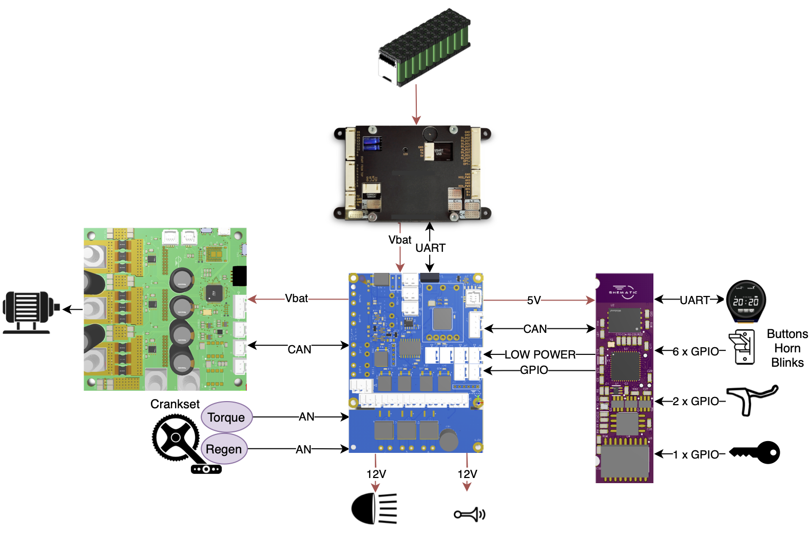
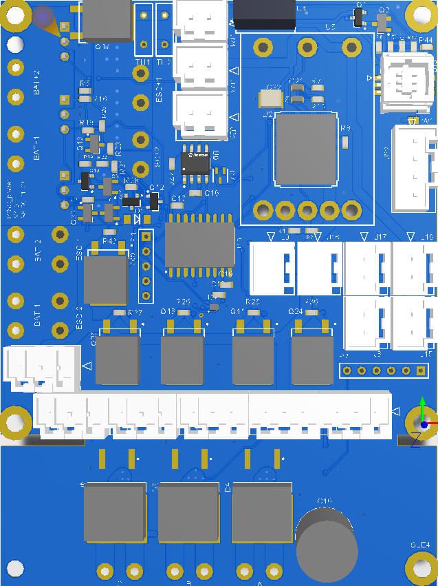
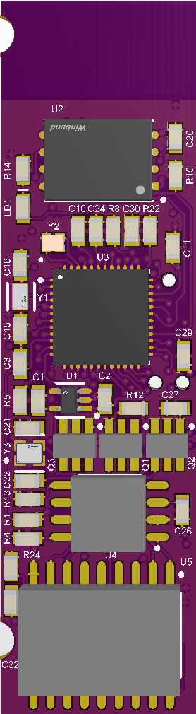
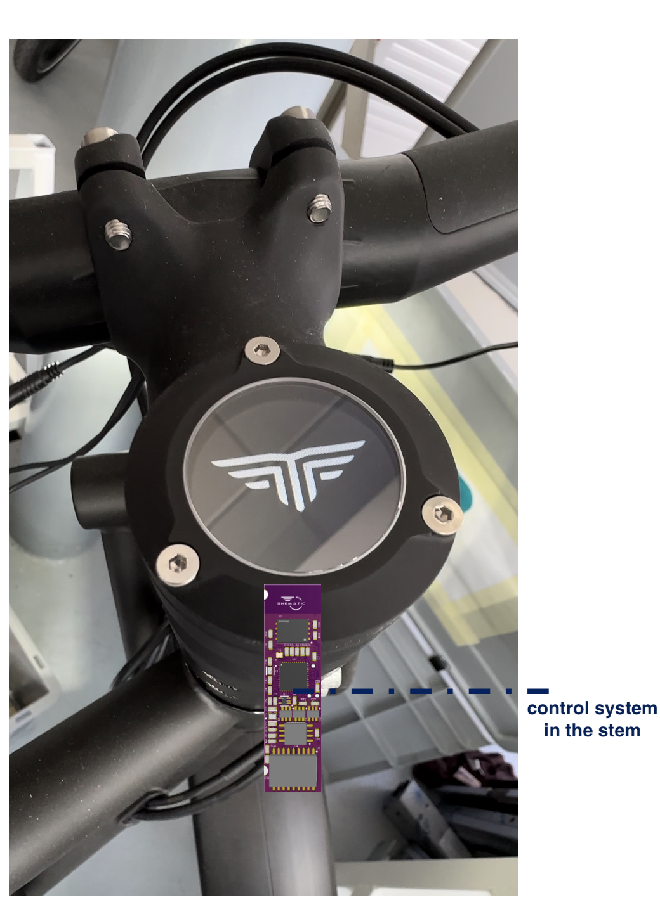
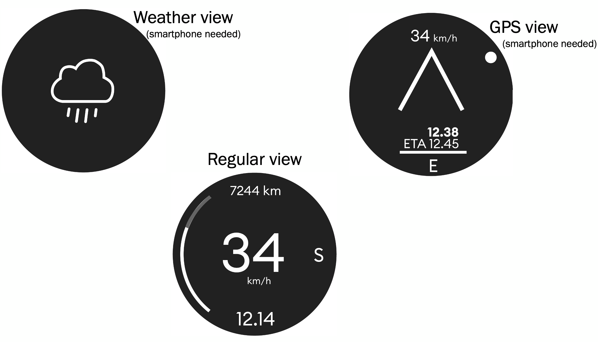
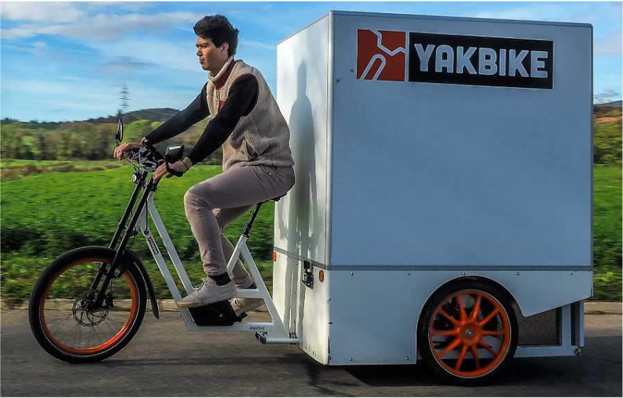
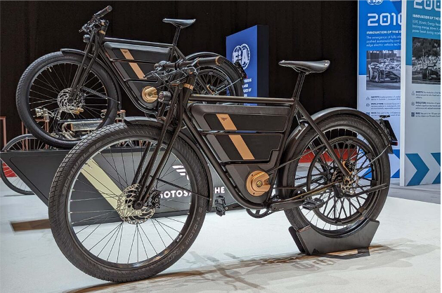
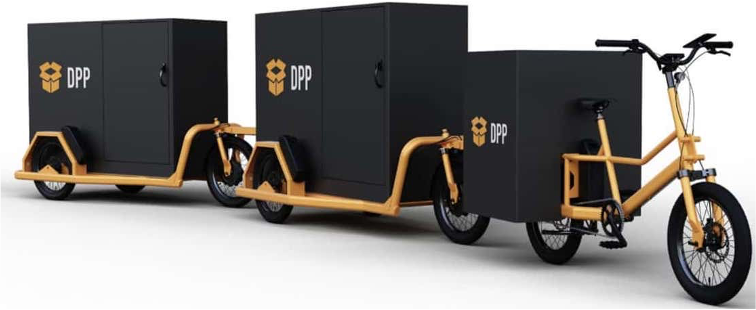

This system is designed to control a Light Electric Vehicle (LEV), ensuring optimal performance, safety, and providing multiple interfaces for connecting with a wide range of accessories. Currently, most LEVs rely on plug-and-play solutions from well-known brands like Bafang or Bosch, which enable quick development but limit users to compatible devices from a single manufacturer. I developed a versatile system that offers all the necessary interfaces to integrate with any device available on the market.

The diagram below outlines the core system, which includes the key components typically used in LEVs. My primary role involved **design**, **assemble**, **program** and **maintain** the **blue** and **purple** PCBs. Additionally, I developed the green PCB based on the [VESC](https://vesc-project.com/) project. I had the opportunity to assemble and mount SMD components on those PCBs with several industrial machines like pick'n'place, solder paste printer, steam phase oven and infrared oven.

    

# Power & interfaces
The blue PCB has two main roles. First, it supplies all the power rails required by the system. Second, it provides the necessary interfaces to connect with a wide variety of devices. Key features of this PCB include:

* STM32 MCU
* Power rails
    * 5V
    * 12V @ 3A
    * VBAT @ 90A max
* Precharge circuit for the system's capacitors
* Several connectos
    * Crankset sensors (torq and cadence)
    * Isolated UART
    * CAN, SPI, I2C
    * Power rails

 

The firmware is bare-metal without any RTOS. Its primary function is to read inputs and relay them to the system's control PCB, which processes the data, makes decisions, and sends commands back for execution. Several drivers were developed for communication protocols such as CAN, SPI, and UART. The firmware is also responsible for driving output transistors for accessories and ensuring that power rails remain stable. Finally, it verifies the proper execution of the precharge circuitry. 

# Control
The control PCB functions as the brain of the vehicle and comes with several key features:

* TI CC2652R
* BLE connectivity
* External flash memory
* Compact design (14x55mm) to fit in a bicycle's stem
* FPC connector (for LCD)
* Connector for inputs/outputs (brake's switch, key, throttle, etc)
* Several communication protocol feature: CAN, SPI, UART, I2C

 

 

A specific firmware ensures that all components function properly. A custom-built bootloader enables board updates via Bluetooth with a specific Qt App we made. The firmware is based on TI-RTOS and manages several key tasks essential to the project’s functionality:

* BLE
    * updates
    * data exchanges (with the Qt App)
* User Interface using a 1.3" display
* CAN for managing vehicles main components
* IoT for getting vehicles datas and provide ML features (e.g. predictive maintenance, real autonomy, etc)

To implement these features, I developed custom drivers for UART, Bluetooth, SPI, and CAN, and created several tasks (threads) to manage each of the functionalities mentioned above, with a strong emphasis on security and resource sharing (concurrency).

Below is an integration example of the control system:

 

And here is some UI examples:

 

# Projects

Finally, those systems are used across several projects such as:

 

<a href="https://www.yakbike.co/fr">Yakbike</a>

 

<a href="https://motosacoche.swiss/">Motosacoche</a>

 

<a href="https://www.pelicancycles.com/pelicantrain">Pelican-train</a>

