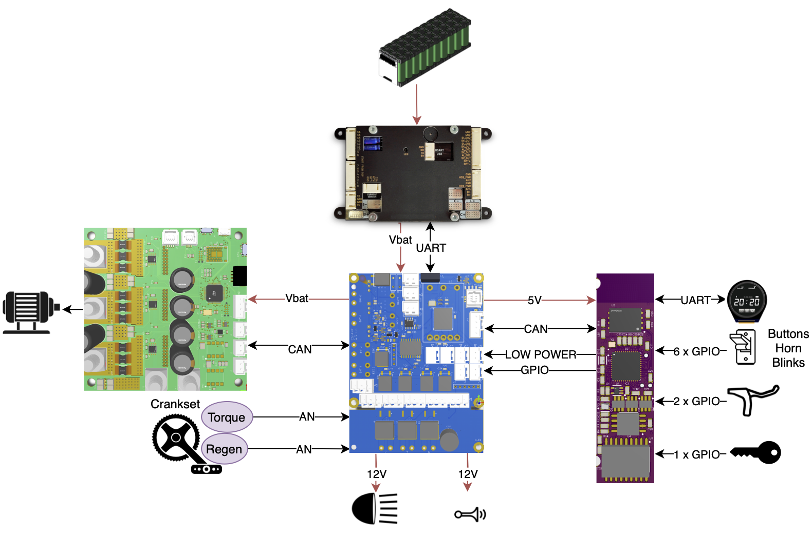

This system is designed to control a Light Electric Vehicle (LEV), ensuring optimal performance, safety, and providing multiple interfaces for connecting with a wide range of accessories. Currently, most LEVs rely on plug-and-play solutions from well-known brands like Bafang or Bosch, which enable quick development but limit users to compatible devices from a single manufacturer. I developed a versatile system that offers all the necessary interfaces to integrate with any device available on the market.

Below is the base system containing every main parts that are generally used in every LEV. My mission was to **design**, **assemble**, **program** and **maintain** the **blue** and **purple** PCBs. I also made the green one based on [VESC](https://vesc-project.com/) project. I had the opportunity to assemble and mount SMD components on those PCBs with several industrial machines like pick'n'place, solder paste printer, steam phase oven and infrared oven.

    

# Power & interfaces
The blue PCB has two main roles. The first is to provide all the power rails needed by the system and the second is to provide all necessary interfaces to connect with a large range of devices. This PCB has the following features:

* STM32 MCU
* Power rails
    * 5V
    * 12V @ 3A
    * VBAT @ 90A max
* Precharge circuit for the system's capacitors
* Several connectos
    * Crankset sensors (torq and cadence)
    * Isolated UART
    * CAN, SPI, I2C
    * Power rails

 

The firmware is bare-metal without any RTOS. Basically, it reads inputs, and send it to system's brain. The brain will take decisisions and send it back. 

# Control
The control PCB is used as the brain of vehicles. It has several features:

* TI CC2652R
* BLE connectivity
* External flash memory
* Compact design (14x55mm) to fit in a bicycle's stem
* FPC connector (for LCD)
* Connector for inputs/outputs (brake's switch, key, throttle, etc)
* Several communication protocol feature: CAN, SPI, UART, I2C

 

 

A specific firmware ensure that every component works well. A tailor-made bootloader allows the board's updates through Bluetooth. The firmware is based on TI-RTOS and several tasks manage the project's key features:

* BLE
    * updates
    * data exchanges (with dedicated App)
* UI with 1.3" display
* CAN for managing vehicles main components
* IoT for getting vehicles datas and provide ML features (e.g. predictive maintenance, real autonomy, etc)

Below is an integration example of the control system:

 

And here is some UI examples:

 

# Projects

Finally, those systems are used across several projects such as:

 

<a href="https://www.yakbike.co/fr">Yakbike</a>

 

<a href="https://motosacoche.swiss/">Motosacoche</a>

 

<a href="https://www.pelicancycles.com/pelicantrain">Pelican-train</a>
